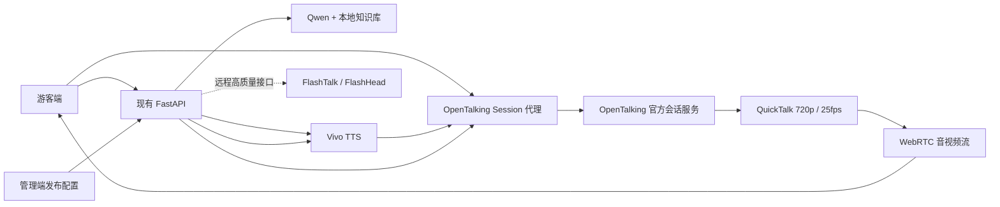

# 灵境导游比赛级产品化设计

日期：2026-07-11

## 目标

把现有“问答页面 + 整段口型视频 + 基础后台”升级为可演示、可运营、可验收的景区数字人导览产品。游客端以实时数字人讲解和“个性化推荐游线”为主任务；管理端承担数字人发布、知识维护、游客感受闭环与质量报告；OpenTalking 官方 session + WebRTC 是主链路，旧整段 MP4 仅作为不可用时的兼容兜底。

## 设计基准

- 选定视觉：`reports/design-reference/selected-option-2-shanshui-scroll.png`。
- 参考 NANFU 官网的大视觉焦点、克制层级和滚动节奏，但不复制品牌配色或商业素材。
- 游客端采用“山水长卷”：暖白底、灵山日景、宋体标题、深墨蓝正文、景区蓝为功能色、少量朱砂色为状态强调。
- 管理端采用同一设计语言的高密度运营版本：弱装饰、强信息层级、清晰数据来源和发布状态。
- 禁止继续叠加玻璃卡片、无意义渐变、卡中套卡和技术调试文案。

## 核心体验

### 游客端

首屏同时容纳景区影像、数字人和导览对话。数字人保持在视觉焦点区并接收 WebRTC 音视频流；右侧导览区提供“对话 / 当前游线”双模式。游客生成游线后，回答中出现紧凑摘要，完整地图在同一导览区切换显示，路线一直保留到游客主动关闭或生成新路线。手机端将导览区改为全宽视图，绝不把地图作为第三个网格子项追加到页面底部。

### 管理端

一级导航包含“运营概览、知识内容、数字人形象、游客感受、质量报告”。数字人形象页支持资产、服装版本、声音试听、默认声音、人设、预览和发布；发布配置被游客端和 TTS/OpenTalking 实际读取。知识内容支持编辑、删除、重新索引。游客感受包含文字反馈、情感趋势、服务建议和处理闭环。质量报告区展示冻结问答集准确率与端到端延迟，并明确区分本地自测和官方评审结果。

## OpenTalking 运行架构

本地 4060 8GB 配置固定为 QuickTalk、720p、25fps、短音频切片和模型/形象预热。真正的中性微动作模板由管理员上传授权的真人/数字人源视频后预处理生成；当前静态图生成模板只能标记为兼容兜底，不能被描述成真实微动作素材。后台保留远程驱动提供方接口，未来可接 FlashTalk/FlashHead；MuseTalk 不作为本机承诺能力。

## 数据与状态

- `digital_human_profiles`：名称、人设、发布状态、驱动提供方、形象资产、服装版本、声音、源视频、OpenTalking 形象 ID、预热状态、版本号。
- `knowledge_documents`：内容、状态、索引版本、更新时间，支持上传、修改、删除与重建索引。
- `feedback`：星级、文字、情感、关注点、处理状态、服务建议和管理备注。
- `quality_runs`：冻结数据集版本、准确率、样本明细、端到端阶段耗时、运行环境和是否官方评测。
- 游客会话保存当前游线 ID；界面切换模式不清空路线，只有显式关闭或新路线替换才更新。

## 可用性与无障碍

- 对话区使用 `role="log"` 和适度的 `aria-live`；输入框、图标按钮、标签页都有可读名称。
- 标签页遵循 tablist/tab/tabpanel 语义并支持键盘。
- 交互控件最小触控目标 44px，清楚展示 hover、focus、loading、empty、error 和 published 状态。
- `prefers-reduced-motion` 下停用非必要动效，WebRTC 视频本身不受影响。

## 验收边界

- “已实现/演示就绪”必须由测试、构建、运行态检查和同视口视觉对照共同支持。
- 准确率 90% 与小于 5 秒只报告冻结本地数据集的实测结果，不能替代比赛官方测试。
- OpenTalking 会话服务不可用时应明确降级并保留问答/TTS，不得把旧 MP4 兜底伪装为实时流。
- 数据看板必须标明“实时交互数据 / 示例景区数据 / 本地自测数据”。

