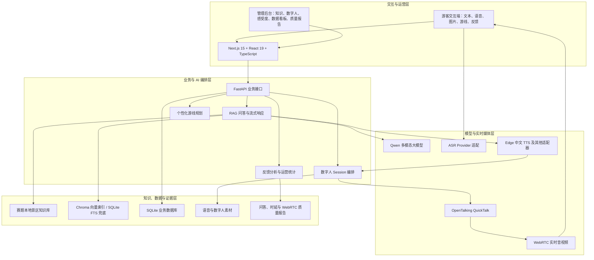
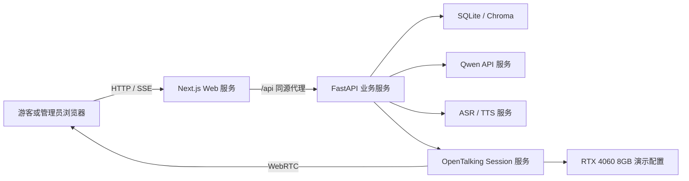
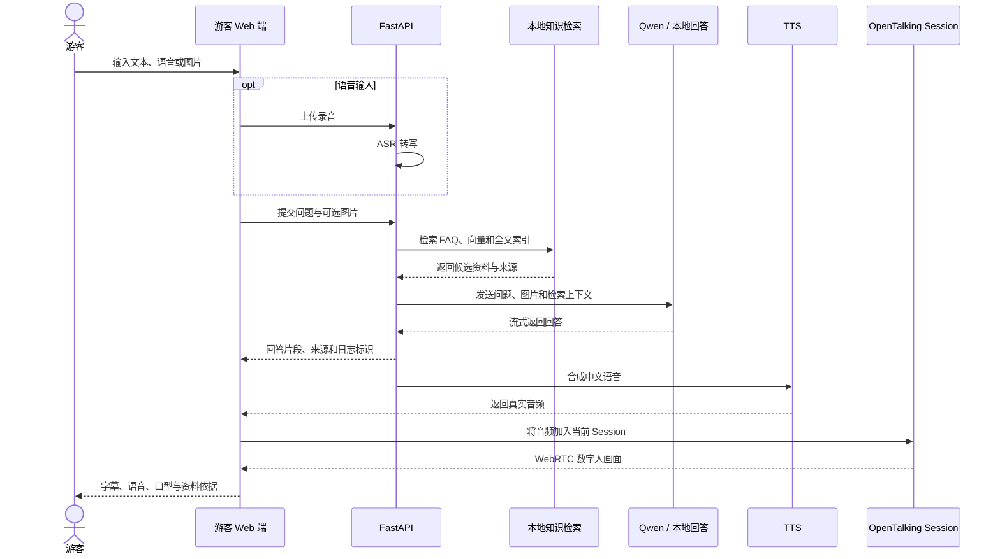

# 灵境导游——面向智慧景区的多模态 AI 数字人导览系统

## 产品总体设计文档

| 文档属性 | 内容 |
| --- | --- |
| 文档版本 | V1.0 |
| 编制日期 | 2026 年 7 月 16 日 |
| 文档类型 | 现有实现版产品总体设计 |
| 适用阶段 | 初赛作品提交、演示视频制作、现场答辩与系统验收 |
| 示范景区 | 无锡灵山胜境 |
| 核心形态 | 游客交互端 + 景区管理后台 + 本地知识库 + AI 数字人服务 |
| 能力口径 | 只描述当前代码、配置与本地证据能够支持的能力；官方指标以比赛评测为准 |

---

## 1. 文档概述

### 1.1 编写目的

本文档说明“灵境导游”产品的建设背景、业务目标、用户角色、功能范围、总体架构、核心模块、数据与接口设计、AI 与数字人技术路线、部署方案、异常降级策略以及测试验收方法。

本文档同时按照比赛评分项组织可复核证据，便于评审人员快速确认系统对多模态交互、景区知识问答、个性化推荐、数字人驱动和运营管理等要求的覆盖情况。

### 1.2 设计范围

本文档覆盖以下现有实现：

- 面向游客的响应式 Web 交互端；
- 面向景区运营人员的管理后台；
- 基于赛题资料包构建的本地景区知识库；
- Qwen 多模态大模型调用与本地检索回答兜底；
- 语音识别、中文语音合成和字幕播报；
- OpenTalking QuickTalk 数字人及 WebRTC 实时音视频链路；
- 个性化推荐游线；
- 游客反馈、情感趋势、热门主题和运营数据分析；
- 问答质量、数字人链路及端到端时延的验收工具。

GPS 定位容错目前已经具备基础数学计算、精度分级与类型契约，但尚未作为完整生产级定位能力交付。因此本文档将其标记为“扩展基础”，不作为基本功能完成度申报。

### 1.3 术语说明

| 术语 | 说明 |
| --- | --- |
| 多模态交互 | 游客通过文本、语音或图片与系统交互，系统通过文字、语音、字幕和数字人画面反馈 |
| RAG | 检索增强生成，先从本地景区知识库检索资料，再约束大模型依据资料回答 |
| ASR | 自动语音识别，将游客语音转换为文本 |
| TTS | 语音合成，将数字人回答转换为可播放的中文语音 |
| Session | 数字人持续会话，复用已加载模型和形象，避免每轮重新初始化 |
| WebRTC | 浏览器与数字人服务之间的实时音视频传输协议 |
| FAQ 快速通道 | 对高置信度常见问题直接返回资料答案，缩短响应链路 |
| 本地自测 | 团队使用固定或隐藏题集进行的研发验证，不等于比赛官方成绩 |

---

## 2. 项目背景与业务问题

### 2.1 行业背景

国家持续推进文旅产业数字化转型，智慧景区逐步从电子票务、客流监测扩展到智能导览、内容服务和精细化运营。传统人工导游和录音导览设备难以同时满足旺季服务规模、实时互动、个性化讲解和运营反馈等需求。

### 2.2 业务痛点

| 业务痛点 | 传统方式局限 | 本产品应对方式 |
| --- | --- | --- |
| 导游资源稀缺 | 旺季专业导游供不应求，人工服务时间有限 | 提供 7×24 小时在线的 AI 数字人导游 |
| 信息单向传递 | 录音内容固定，无法回答临时问题 | 通过文本、语音和图片进行实时问答 |
| 内容更新滞后 | 设备内容更新成本高，难以及时维护 | 管理后台支持知识文档维护和索引重建 |
| 缺乏个性化 | 所有游客接收相同讲解和路线 | 根据兴趣生成不同游线和讲解重点 |
| 缺少情感连接 | 冰冷设备缺少真人陪伴感 | 使用自然中文语音、字幕和数字人画面讲解 |
| 管理存在盲区 | 难以量化关注点、满意度和服务问题 | 汇总问答、反馈、情感趋势和热门主题 |

### 2.3 产品机会

本产品不是简单地将聊天机器人放入景区页面，而是把“可信知识问答、数字人实时讲解、个性化游线和运营改进”组合为完整服务闭环：

1. 游客提出问题或游览需求；
2. 系统检索本地景区资料并生成带依据的回答；
3. 数字人以语音、字幕和口型画面进行讲解；
4. 系统记录交互、评分和反馈；
5. 管理方依据游客关注点改进知识与服务；
6. 更新后的知识再次进入问答与质量评测。

---

## 3. 产品定位、目标与原则

### 3.1 产品定位

“灵境导游”定位为面向智慧景区的多模态 AI 数字人导览与运营分析平台，服务对象同时包括游客和景区管理方。

游客侧强调“可信、自然、易用”，管理侧强调“可维护、可洞察、可复核”。系统既要提供前台沉浸式导览，也要形成后台运营闭环。

### 3.2 建设目标

- 实现文本、语音和图片输入的一体化游客交互；
- 对景区历史、文化、景点特色、演出和游览建议提供有资料依据的回答；
- 通过中文语音、字幕和实时数字人画面完成讲解；
- 根据游客兴趣生成个性化推荐游线；
- 支持景区知识、数字人形象、声音和人设的运营维护；
- 分析游客关注主题、满意度和情感趋势；
- 建立准确率、链路可用性和响应时延的证据化验收体系；
- 在部分 AI 能力不可用时仍保证游客可以继续完成主要任务。

### 3.3 设计原则

1. **资料可信。** 景区事实优先来自本地资料，并向游客展示资料依据。
2. **游客任务优先。** 提问、听讲解、查看游线和继续操作始终比装饰信息更醒目。
3. **数字人自然陪伴。** 数字人承担讲解和陪伴角色，不遮挡字幕、正文和操作入口。
4. **故障可降级。** 语音、数字人、外部模型或定位任一能力异常时，核心导览仍可继续。
5. **能力如实表达。** 本地自测、单链路时延和像素运动证据不替代官方评测或专家主观评分。
6. **后台低门槛维护。** 运营人员不需要理解模型 ID、服务地址和预热参数即可维护内容与形象。

---

## 4. 用户角色与典型场景

### 4.1 用户角色

| 角色 | 核心诉求 | 主要权限 |
| --- | --- | --- |
| 普通游客 | 快速提问、听取讲解、查看路线、获得陪伴式体验 | 使用问答、语音、图片、游线和反馈功能 |
| 兴趣型游客 | 获取历史文化、自然风光或亲子等定向内容 | 选择兴趣并生成个性化推荐游线 |
| 景区运营人员 | 维护知识与数字人，查看服务数据 | 管理知识、形象、声音、反馈和报表 |
| 系统维护人员 | 确认服务状态和依赖链路 | 查看健康检查、质量报告和运行日志 |
| 比赛评审 | 在有限时间内确认真实能力和实现边界 | 通过演示流程、报告和证据文件复核 |

### 4.2 典型游客场景

**场景一：景点事实问答**

游客询问“九龙灌浴平日演出时间是什么”。系统检索本地景区资料，返回具体信息和资料依据，再通过中文语音和数字人画面进行讲解。

**场景二：兴趣游线推荐**

游客提出“我喜欢历史文化，帮我规划半日游线”。系统依据兴趣和景点资料生成游线摘要，在当前游线面板中展示站点顺序、推荐理由和讲解入口。

**场景三：图片辅助识别**

游客上传景点图片并询问“我现在看到的是哪里”。系统使用多模态模型理解图片，再结合本地景区知识生成谨慎回答。

**场景四：弱能力降级**

语音或数字人服务暂时不可用时，游客仍能通过文本提问、查看回答和资料依据；定位不可靠时，系统不猜测位置，而是引导游客手动选择地标。

### 4.3 典型管理场景

- 查看当日和本周服务人次、热门问答及满意度；
- 新增运营讲解文档并重建对应索引；
- 上传一张有授权的正面形象图，选择声音并发布；
- 查看游客反馈的情感、主题和处理状态；
- 运行或查看问答质量报告，定位未通过样本；
- 根据高频问题和负面反馈修订知识或现场服务。

---

## 5. 需求分析与实现状态

### 5.1 游客交互侧

| 编号 | 需求 | 当前实现 | 状态 |
| --- | --- | --- | --- |
| V-01 | 文本输入 | 支持连续对话和流式回答 | 已实现 |
| V-02 | 语音输入 | 通过 ASR 适配层完成录音转写 | 已实现 |
| V-03 | 图片输入 | 图片与文字共同提交给多模态问答链路 | 已实现 |
| V-04 | 景区知识问答 | 使用 FAQ、混合检索和 Qwen 生成带依据回答 | 已实现 |
| V-05 | 中文语音播报 | Edge 中文神经网络语音为当前 TTS 主线 | 已实现 |
| V-06 | 口型同步 | TTS 音频上传 OpenTalking Session 驱动 QuickTalk | 已真实联调 |
| V-07 | 表情和状态配合 | 实现待机、聆听、整理、讲解、暂停等状态反馈；不把界面动画冒充模型表情 | 专家体验验收 |
| V-08 | 个性化推荐 | 根据游客兴趣生成景点游线和讲解重点 | 已实现 |
| V-09 | 游客反馈 | 支持星级、文字反馈及后台处理闭环 | 已实现 |
| V-10 | 定位辅助 | 已有精度、弱信号和手动地标等基础契约 | 扩展基础 |

### 5.2 管理后台侧

| 编号 | 需求 | 当前实现 | 状态 |
| --- | --- | --- | --- |
| A-01 | 运营数据概览 | 服务人次、问答量、热门问题、满意度与趋势 | 已实现 |
| A-02 | 基础知识查看 | 展示赛题资料、类型、分片数和索引状态 | 已实现 |
| A-03 | 运营知识维护 | 新增、编辑、软删除和按文档重建索引 | 已实现 |
| A-04 | 数字人形象维护 | 上传单张形象图、设置名称、人设和声音并发布 | 已实现 |
| A-05 | 声音试听 | 保存前可生成中文试听语音 | 已实现 |
| A-06 | 游客感受度报告 | 情感趋势、关注主题、满意度和服务建议 | 已实现 |
| A-07 | 反馈处理闭环 | 管理备注及待处理到已解决状态流转 | 已实现 |
| A-08 | 问答质量报告 | 准确率、通过样本、延迟和环境信息 | 已实现 |
| A-09 | 端到端时延报告 | 已实现严格采集与判定工具，30 次现场样本尚未生成 | 待现场验收 |

### 5.3 非功能需求

| 类别 | 设计要求 | 当前实现与口径 |
| --- | --- | --- |
| 多模态模型 | 至少使用一个多模态大模型 | 核心模型为可通过 OpenAI 兼容接口调用的 Qwen 多模态模型 |
| 回答准确率 | 官方事实问答准确率不低于 90% | 固定 17 题本地自测 100%，隐藏 30 题完整自测 93.33%；官方成绩待比赛评测 |
| 自然度 | 语音、口型和表情配合自然 | 已有真实音频驱动和可见嘴部运动证据；最终自然度由专家评估 |
| 响应时延 | 语音问答目标小于 5 秒 | 已实现流式、预热和 Session 复用；完整 30 次 P95 尚待现场采样 |
| 稳定性 | 不崩溃、不长时间无响应 | 提供健康检查、超时、异常捕获、Provider 降级和自动化回归 |
| 可用性 | 户外移动环境可操作 | 响应式页面、较大触控目标、字幕保留和减少动态效果支持 |
| 可维护性 | 内容与形象便于更新 | 知识版本、索引版本、软删除和单图形象发布 |
| 安全性 | 凭据和游客数据受控 | 密钥仅在服务端环境变量；生产部署仍需接入后台认证与权限 |

---

## 6. 系统总体架构

### 6.1 四层架构

### 6.2 架构特点

- 前端与后端通过同源 API 代理通信，浏览器不直接持有模型密钥或内部服务地址；
- FastAPI 负责统一业务编排，外部模型与本地能力通过 Provider 适配层解耦；
- 知识库和运营数据库均可本地运行，降低网络不可用对核心问答的影响；
- 数字人采用持续 Session 和 WebRTC，而非每次生成完整视频后再播放；
- 问答、语音和数字人链路可以独立降级，避免单点异常阻断全部服务；
- 质量报告与业务功能共用真实接口和数据结构，便于复核。

### 6.3 部署拓扑

比赛演示环境采用单机或局域网部署，默认 Web 地址为 127.0.0.1:3000，FastAPI 默认端口为 8000，OpenTalking Session 默认端口为 8210。启动脚本发现端口占用时会选择邻近空闲端口，并通过运行时端口文件保持前后端连接。

---

## 7. 核心业务流程设计

### 7.1 游客问答与数字人讲解

### 7.2 个性化推荐游线

1. 游客以自然语言表达兴趣，例如历史文化、自然风光或亲子体验；
2. 后端从结构化景点资料中筛选匹配景点；
3. 系统依据景点功能、特色、开放信息和可选起点生成顺序；
4. 回答区域显示紧凑摘要，当前游线面板展示完整站点；
5. 游客点击“讲这一站”时保留当前游线并发起景点讲解；
6. 只有游客主动关闭或生成新游线时才替换当前路线。

游线地图使用无固定文字和路径的景区基图，站点、连线、中英文标签和当前站点由前端根据真实游线数据叠加，避免静态图片与交互状态不一致。

### 7.3 管理运营闭环

---

## 8. 游客交互端设计

### 8.1 页面结构

游客端采用“数字人舞台 + 对话任务区”的主要布局：

- 数字人舞台显示人物画面、当前状态、字幕和播报控制；
- 对话区展示游客问题、数字人回答、资料依据和输入入口；
- 当前游线与对话在同一区域切换，避免长页面大幅跳动；
- 手机端使用全宽布局，字幕和核心输入入口始终可见。

### 8.2 多模态输入

| 输入方式 | 处理方式 | 异常处理 |
| --- | --- | --- |
| 文本 | 直接进入问答与检索链路 | 空输入和超长输入在前端与后端校验 |
| 语音 | 浏览器录音后提交 ASR | 权限拒绝或识别失败时提示改用文本 |
| 图片 | 上传图片并附带文字问题 | 校验格式与大小；无法识别时避免确定性猜测 |

### 8.3 交互状态机

数字人面向游客使用业务语言呈现状态：

1. 导游在线；
2. 正在聆听；
3. 正在整理；
4. 正在讲解；
5. 讲解已暂停；
6. 服务暂不可用但可继续文本导览。

状态通过短文案、颜色和轻微动画表达。启用“减少动态效果”后，状态仍通过文字和颜色可辨识。

### 8.4 回答呈现

- 回答采用流式输出，优先让游客看到首段有效内容；
- 景区事实回答展示资料标题和来源摘要；
- 语音、字幕和数字人讲解使用同一回答文本；
- 无可靠依据时不编造具体时间、票价或位置；
- 技术 Provider、模型地址和预热术语不暴露给普通游客。

### 8.5 可访问性

- 主要触控目标不小于约 44 像素；
- 正文、字幕和状态保持可读对比度；
- 不仅依靠颜色表达错误或状态；
- 保留键盘焦点和语义标签；
- 手机端不隐藏字幕；
- 支持 prefers-reduced-motion；
- 当前不宣称已通过正式 WCAG 等级认证，发布前仍需专项检查。

---

## 9. 管理后台设计

### 9.1 运营概览

运营概览展示服务人次、问答量、热门问答、景点关注分布、满意度和服务趋势。页面区分资料包中的历史样本与系统产生的实时交互数据，不把示例 Excel 数据表述为当日真实客流。

### 9.2 知识库管理

- 显示三份赛题基础资料及其文件类型、记录数和索引状态；
- 基础资料为只读，避免误删比赛知识依据；
- 运营人员可以新增、编辑和软删除自建知识文档；
- 每个运营文档分别记录内容版本、索引版本和索引状态；
- 更新内容后可按文档重建索引；
- 索引失败时保留原有可用版本并显示明确状态。

### 9.3 数字人形象管理

管理员只需完成四个业务步骤：

1. 上传一张有授权的正面或轻微侧面半身形象图；
2. 设置中文显示名称和人设；
3. 选择中文声音并试听；
4. 点击保存并应用。

后端自动完成图片校验、素材准备、QuickTalk 形象目录生成、预热和游客端配置切换。管理页面不要求运营人员理解模型 ID、服务地址和 GPU 参数。

### 9.4 游客感受度

系统结合星级和文字反馈生成：

- 正向、中性或负向情感标签；
- 情感来源和置信度；
- 游客关注主题；
- 服务改进建议；
- 管理备注和处理状态。

当前实现支持规则兜底，避免外部模型不可用时反馈无法入库。感受度分析用于运营辅助，不替代专业舆情分析或个体心理判断。

### 9.5 质量报告

后台可以查看固定题集和历史质量运行，内容包括：

- 数据集版本；
- 样本数量、通过数量和准确率；
- 每题关键事实、来源依据和失败原因；
- 平均、中位数和 P95 延迟；
- 运行时间与环境信息；
- 是否属于官方评测。

---

## 10. 多模态大模型与知识库设计

### 10.1 核心模型

系统明确使用 Qwen 多模态大模型作为核心 AI 能力，通过 OpenAI 兼容接口接入。模型名称由服务端环境变量配置，当前示例配置为 qwen3.5-omni-plus-2026-03-15。

Qwen 主要承担：

- 自然语言理解与景区讲解生成；
- 图片内容理解；
- 多轮问题语义理解；
- 根据兴趣生成个性化讲解；
- 在检索资料约束下组织自然回答。

未配置有效 API 凭据时，系统可使用本地检索回答维持基本演示，但该模式不代表完整多模态大模型链路已经启用。

### 10.2 本地资料构成

本地知识库基于赛题示范景区资料包构建：

| 来源 | 用途 |
| --- | --- |
| 灵山胜境景点结构化数据集 | 提取景点名称、位置、特色、功能和开放信息 |
| 灵山胜境历史、文化、景点特色与个性化游览指南 | 生成历史文化讲解、知识分片和 FAQ |
| 景点景区旅游数据行为分析数据 | 用于运营分析样本，不作为景点问答分片 |

当前重建结果：

- 3 个资料来源；
- 22 个景点；
- 66 个可检索知识分片；
- 113 条 FAQ；
- Chroma 向量索引状态正常；
- SQLite 全文或关键词检索作为兜底。

### 10.3 知识入库流程

### 10.4 问答检索策略

系统采用分层检索：

1. 对高置信度、表达明确的常见问题匹配 FAQ；
2. 对一般问题执行 Chroma 向量召回；
3. 使用 SQLite FTS 或关键词检索补充和兜底；
4. 合并、去重并排序候选资料；
5. 将问题、图片和候选资料交给 Qwen；
6. 在回答中返回实际使用的资料依据；
7. Qwen 不可用时根据检索内容生成本地资料回答。

FAQ 快速通道只有在置信度足够时使用，避免相似问题错误命中。所有回答都会记录实际 Provider 和来源，便于后续分析。

### 10.5 回答约束

- 景区具体事实必须优先来自检索资料；
- 资料未覆盖时明确说明信息范围；
- 不虚构演出时间、票价、宗教史实和地理位置；
- 图像判断存在不确定性时使用谨慎表达；
- 推荐游线不得包含知识库不存在的景点；
- 对危险、违法或明显偏离导览场景的问题进行安全处理。

---

## 11. 语音交互设计

### 11.1 ASR 适配

ASR 层支持 FunASR、Vivo、sherpa-onnx 和 mock 等适配入口。比赛真实演示不得使用 mock 识别冒充真实语音能力。具体 Provider 由环境配置决定，前端只展示业务状态。

语音输入流程包括录音权限申请、录音采集、格式校验、上传、识别、文本确认和问答提交。识别失败或权限被拒绝时，系统引导游客继续使用文本。

### 11.2 TTS 适配

当前主线为 Edge 中文神经网络语音，并保留 Vivo、CosyVoice、sherpa-onnx 和 Piper 等扩展入口。

游客可以控制：

- 音色或讲解风格；
- 语速；
- 音量；
- 字幕显示；
- 暂停、继续和停止。

语速和音量同时影响语音生成或当前播放器，不仅是界面上的静态选项。

### 11.3 语音降级

- 云端 ASR 异常：切换本地适配器或使用文本；
- TTS 异常：保留回答文本和字幕；
- 音频播放被浏览器策略阻止：提示游客主动点击播放；
- mock 音频仅用于离线回归，不进入赛事证据。

---

## 12. 数字人设计

### 12.1 技术路线

数字人主链路为：

    回答文本
      → Edge 中文 TTS
      → OpenTalking Session 音频入队
      → QuickTalk 常驻 Worker
      → WebRTC 持续视频

系统不再将“等待整段 MP4 生成后播放”作为实时主方案。浏览器先建立持续 Session，回答音频产生后直接上传同一会话驱动口型。

### 12.2 当前演示配置

| 配置项 | 当前值 |
| --- | --- |
| 数字人引擎 | OpenTalking QuickTalk |
| 运行设备 | cuda:0 |
| 目标画面 | 720 × 720 |
| 目标帧率 | 25 fps |
| 待机模板 | 60 帧，约 2.4 秒循环 |
| 切片长度 | 28 |
| 渲染分块 | 500 ms |
| 性能策略 | Worker Cache、模型预热、形象预热 |
| 目标硬件 | RTX 4060 8GB 比赛演示机 |

以上是本项目演示配置，不代表所有 RTX 4060、所有素材或所有并发负载都能达到相同效果。

### 12.3 Session 状态

数字人会话至少包含创建、准备、可用、说话、中断和关闭状态。前端只有在 Worker 就绪后建立真实 WebRTC 画面，不能把服务健康接口正常等同于形象和模型已经准备完毕。

### 12.4 降级顺序

系统按以下顺序选择数字人能力：

    session → remote → legacy_mp4 → audio_only

- session：当前比赛演示主链路；
- remote：预留高质量远程 Provider，当前不宣称已经部署；
- legacy_mp4：旧整段视频桥接，仅用于兼容或录屏；
- audio_only：保留真实语音和字幕，不把静态海报或 CSS 动画表述为口型同步。

### 12.5 自然度口径

当前真实联调证明数字人在说话期间持续输出非冻结画面并出现可见嘴部运动。该证据不能替代专家对口型同步、语音、表情和整体自然度的主观评价。

---

## 13. 个性化推荐与定位容错

### 13.1 推荐输入

当前推荐请求主要使用：

- 游客兴趣；
- 可选起始景点；
- 景点结构化资料；
- 景点开放和特色信息。

系统不使用未经验证的真实拥堵、票务或天气数据生成确定性结论。

### 13.2 推荐结果

推荐结果包含：

- 游线标题与兴趣标签；
- 景点顺序；
- 每站推荐理由；
- 位置或开放信息；
- 资料来源；
- 游览注意事项。

### 13.3 定位容错基础

现有代码已定义 GPS、手动地标、摄像头和无定位等来源，以及请求中、已确认、不确定、拒绝、不可用和过期等状态。定位精度可划分为精确、近似、弱信号和未知。

当前位置只有在以下条件满足时才可影响游线：

- 景点坐标来自经过确认的资料；
- 坐标系明确；
- 定位精度在允许范围；
- 定位结果属于当前游线候选景点；
- 游客确认起点。

生产坐标尚未完整录入，游客端完整定位流程尚未全部交付，因此比赛基础演示应以兴趣推荐和手动地标为主。

---

## 14. 前端模块设计

| 模块 | 核心职责 | 主要依赖 |
| --- | --- | --- |
| TouristExperience | 游客输入、会话、语音状态、流式回答、游线和反馈编排 | Chat、ASR、TTS、Route、Feedback API |
| DigitalHuman | 待机画面、WebRTC、字幕、播报状态和媒体控制 | Avatar Session、TTS、WebRTC |
| ItineraryPanel | 游线站点、路径、推荐理由和单站讲解 | Route Plan |
| AdminConsole | 管理后台导航、状态与数据加载 | Admin API |
| CompetitionPanels | 知识、数字人、感受度和质量面板 | Competition Admin API |
| MiniCharts | 趋势、分布和满意度轻量可视化 | Dashboard Metrics |

模块边界以单一职责为原则：交互流程、数字人媒体和游线显示相互独立，通过明确的数据类型通信。

---

## 15. 后端模块设计

| 模块 | 核心职责 |
| --- | --- |
| main | FastAPI 启动、游客接口和通用后台接口 |
| ingestion | 资料解析、清洗、知识切分和数据导入 |
| retrieval | FAQ、向量、全文和关键词检索 |
| vector_backends | Chroma、FAISS 等向量后端适配 |
| qwen_client | Qwen OpenAI 兼容接口封装 |
| voice | ASR 与 TTS Provider 适配 |
| opentalking_session | Session 生命周期、音频与 WebRTC 转发 |
| avatar_session_api | 数字人会话对外接口 |
| avatar / profile_runtime | 数字人配置、形象素材和运行配置 |
| admin_competition | 知识、形象、反馈、概览和质量管理接口 |
| quality_evaluation | 问答准确率和质量样本评测 |
| db | SQLite 建表、连接和数据访问 |
| schemas | 请求、响应及业务对象约束 |

---

## 16. 数据设计

### 16.1 数据分层

| 数据层 | 主要表或文件 | 用途 |
| --- | --- | --- |
| 基础知识 | source_files、attractions、knowledge_chunks、faqs | 保存资料来源、景点、分片和 FAQ |
| 运营知识 | knowledge_documents | 保存运营文档及内容、索引版本 |
| 数字人配置 | digital_human_config、digital_human_profiles、digital_human_active | 保存当前形象、声音、人设和发布状态 |
| 交互日志 | qa_logs | 保存问题、回答、来源、Provider、游客匿名标识和时间 |
| 游客反馈 | feedback | 保存评分、文字、情感、主题、建议、备注和处理状态 |
| 运营指标 | dashboard_metrics | 保存资料样本和实时交互聚合指标 |
| 质量运行 | quality_runs、reports/quality | 保存题集版本、结果、延迟、环境和证据 |
| 媒体资源 | storage/audio、opentalking-avatar、opentalking-output | 保存语音、形象和兼容视频 |

### 16.2 关键数据约束

- 景点使用唯一 spot_id；
- 基础资料保留校验值和导入时间；
- 运营知识采用软删除；
- 内容版本与索引版本分别记录；
- 质量运行记录 official_evaluation 标识；
- 反馈评分限定在合法范围；
- Provider 和资料来源随问答日志保存；
- 不在数据文件、截图或报告中保存 API 密钥。

### 16.3 数据来源边界

三份资料中，两份 DOCX 用于景点问答知识，XLSX 用作运营分析样本。系统在管理后台明确标注数据范围，避免将资料包样本冒充系统实时客流。

---

## 17. 接口设计

### 17.1 游客接口

| 接口组 | 典型路径 | 说明 |
| --- | --- | --- |
| 问答 | /api/chat、/api/chat/stream | 普通和流式问答 |
| 游线 | /api/route-plan | 生成个性化推荐游线 |
| ASR | /api/asr/transcribe | 上传录音并转写 |
| TTS | /api/tts/synthesize | 合成中文语音 |
| 数字人 | /api/avatar/session-capability、Session 创建、音频、WebRTC、中断和事件接口 | 管理实时数字人 |
| 反馈 | /api/feedback、/api/feedback/text | 提交评分和文字反馈 |

### 17.2 管理接口

| 接口组 | 说明 |
| --- | --- |
| Overview | 服务、知识、数字人、反馈和质量概览 |
| Knowledge Documents | 文档查询、新增、编辑、软删除和重建索引 |
| Digital Human Profiles | 形象上传、配置、声音试听、预览、发布和当前形象 |
| Feedback | 反馈查询、管理备注和状态更新 |
| Quality Runs | 质量运行、最新结果和端到端报告 |
| Logs and Dashboard | 问答日志、汇总、感受度报告和运营数据 |
| Health | 模型、语音、向量库和数字人能力状态 |

### 17.3 响应设计

- 普通 JSON 接口使用统一成功状态、数据和消息结构；
- 流式问答使用 meta、delta、narration、done 和 error 等事件；
- 回答对象包含文本、来源、实际 Provider 和日志标识；
- 错误响应使用可读业务消息，同时在服务端保留诊断信息；
- 管理端接口返回索引、版本和数据来源状态，游客端不暴露内部技术字段。

---

## 18. 异常处理与降级设计

| 异常场景 | 检测方式 | 降级策略 | 用户结果 |
| --- | --- | --- | --- |
| Qwen 未配置或超时 | 配置检查、请求超时 | 使用本地检索回答 | 仍可获得资料型答案 |
| Chroma 不可用 | 向量后端健康检查 | 使用 SQLite FTS 或关键词检索 | 问答继续但召回能力可能下降 |
| ASR 失败 | 转写接口错误 | 提示改用文本或切换本地 Provider | 不阻塞问答 |
| TTS 失败 | 合成接口错误或音频无效 | 只显示文字和字幕 | 保留答案 |
| Session 未就绪 | 能力接口和 Worker 状态 | 等待、重试或进入 audio_only | 不把海报冒充口型 |
| WebRTC 断连 | 连接状态和轨道事件 | 重建 Session 或降级语音 | 保留字幕和控制 |
| 定位拒绝或弱信号 | 浏览器权限、精度和时间戳 | 手动地标与现有游线 | 不猜测位置 |
| 知识重建失败 | 索引状态和异常日志 | 保留旧索引版本 | 已发布问答不中断 |
| 外部服务响应慢 | 超时、流式首段和健康检查 | 取消当前请求并提示重试 | 避免长时间无反馈 |

所有降级都遵循“真实能力标识”原则：mock、静态海报、固定脚本和 CSS 动画不能作为正式多模态或数字人证据。

---

## 19. 性能与稳定性设计

### 19.1 性能策略

- 问答采用流式响应，减少首段等待；
- FAQ 高频问题使用高置信度快速通道；
- Qwen 客户端、向量库和数据库连接复用；
- QuickTalk 模型、形象和 Worker 预热；
- 数字人 Session 在多轮讲解间持续复用；
- 语音生成与部分页面状态更新并行执行；
- WebRTC 直接传输连续画面；
- 运行端口自动探测，降低现场启动失败概率。

### 19.2 时延定义

比赛语音问答总时延以“录音停止”为起点，以“首个有效音频播放”和“首个可见口型”两者较晚者为终点：

    end_to_end_ms =
      max(first_valid_audio_ms, first_visible_mouth_ms)
      - recording_stopped_at

ASR、问答、TTS 和 Session 入队阶段用于诊断，不进行简单相加，以免重复计算并行时间。

### 19.3 稳定性策略

- 启动前检查依赖和配置；
- FastAPI、Next.js 和 OpenTalking 分进程运行；
- 健康接口与实际 Worker 就绪状态分开；
- 请求超时、错误捕获和可取消操作；
- 数字人中断与 Session 释放接口；
- SQLite 本地持久化；
- 知识更新采用版本状态；
- 离线回归与真实服务检查分开执行。

---

## 20. 安全与隐私设计

### 20.1 当前实现

- Qwen、Vivo 等服务凭据仅保存在服务端环境变量；
- 前端通过同源代理访问后端；
- 文档、图片和音频上传执行格式和大小校验；
- 凭据不写入截图、报告或提交包；
- 游客使用匿名标识进行交互统计；
- 后台可删除问答日志和处理反馈；
- 基础资料只读，运营文档软删除。

### 20.2 部署边界

当前比赛版本以本机或受控局域网演示为主要环境。若部署到公开互联网，必须补充：

- 管理员登录和基于角色的访问控制；
- HTTPS；
- 文件恶意内容检测；
- API 限流和防滥用；
- 游客隐私告知与数据保留期限；
- 日志脱敏、审计和备份恢复；
- 第三方模型数据处理协议核查。

上述项目是生产部署条件，不在当前本地比赛演示中被描述为已经完成。

---

## 21. 测试与验收设计

### 21.1 六层测试体系

| 层级 | 测试内容 | 主要证据 |
| --- | --- | --- |
| 单元测试 | 数据库、检索、语音、配置、情感和定位数学 | Python 与 Node 测试 |
| 契约测试 | API Schema、状态机、前后端字段和降级语义 | 类型检查与契约测试 |
| 功能审计 | 游客流程、管理后台、文案、启动脚本 | flow、admin、copy、goal audit |
| 问答质量 | 固定 17 题和独立隐藏 30 题 | frozen / hidden QA 报告 |
| 真实链路 | Qwen、ASR、TTS、Session、WebRTC 与嘴部 ROI | live check 与 WebRTC 报告 |
| 现场验收 | 30 次语音 P95、连续操作和专家自然度 | 浏览器采样、演示视频和专家评分 |

### 21.2 当前问答证据

| 数据集 | 结果 | 请求成功率 | 平均延迟 | 中位延迟 | P95 延迟 | 结论边界 |
| --- | ---: | ---: | ---: | ---: | ---: | --- |
| 固定景区题集 | 17/17，100% | 100% | 2223.11 ms | 46.43 ms | 6825.17 ms | 本地自测，非官方 |
| 独立隐藏题集 | 28/30，93.33% | 100% | 6287.52 ms | 5075.67 ms | 15402.35 ms | 本地自测，非官方 |

隐藏题集覆盖历史、文化、景点、票务、演出和游览建议六类问题，与固定题集规范化后零重复。最后两题暴露的问题已经进行定向修复，但完整 30 题尚未在修复后重跑，因此本文档仍使用 28/30，不写成 30/30。

### 21.3 当前数字人真实联调证据

| 检查项 | 当前结果 |
| --- | ---: |
| 创建 Session 到首个视频帧 | 755.5 ms |
| 音频上传接口耗时 | 173.0 ms |
| 音频上传到 speaking | 185.5 ms |
| 音频上传到可见嘴部运动 | 2927.1 ms |
| speaking 采样帧 | 126 帧 |
| speaking 唯一帧 | 126 帧 |
| 嘴部帧差平均 / P95 / 峰值 | 0.6294 / 3.1925 / 7.5217 |

真实联调已经验证视频轨、WebRTC 连接、speaking 状态、连续帧变化和可见嘴部运动。该结果来自当前样本和当前素材，不等于完整语音问答时延，也不等于专家自然度得分。

### 21.4 端到端目标

旧端到端报告阶段合计为 17738.99 ms，同时缺少 ASR 和浏览器首个可见口型数据，因此 measurement_complete=false，不能证明达到小于 5 秒目标。

严格验收要求：

- 真人完成 30 次“录音—提问—听到语音并看到口型”的完整操作；
- 逐样本记录 ASR、问答首段、TTS、Session 入队、首个有效音频和首个可见口型；
- 所有样本使用真实 Provider 和 session_stream；
- 样本完整率与请求成功率为 100%；
- 以 30 次端到端时延 P95 小于 5 秒作为本地目标通过条件。

当前尚未生成这组现场样本，因此文档将其标记为“待现场验收”。

### 21.5 推荐验证命令

    npm run startup-audit
    npm run typecheck
    npm run flow-audit
    npm run admin-audit
    npm run copy-audit
    npm run goal-audit
    .\.venv\Scripts\python.exe -m unittest discover -s backend\tests -p test_*.py
    npm run build
    npm run live-check
    npm run competition-check

其中 self-check 使用 mock ASR/TTS，只能用于离线回归；competition-check 的严格模式需要真实浏览器 30 次样本。

---

## 22. 技术创新设计

### 22.1 可信多模态 RAG

系统不是让多模态模型脱离资料自由生成，而是将图片理解、游客问题和本地景区检索结果共同输入模型，并向游客展示资料依据。在保持自然语言体验的同时降低景区事实幻觉。

### 22.2 持续 Session 实时数字人

通过 OpenTalking Session、QuickTalk 常驻 Worker 和 WebRTC 持续流，将一次性视频生成改为可复用实时会话。音频可以直接加入当前会话，适合多轮导览。

### 22.3 运营数据反哺知识

游客问答、评分、情感和关注主题不是只用于展示报表，而是连接到知识修改、索引重建和题集回归，形成可持续运营闭环。

### 22.4 证据化工程

系统分别记录：

- 比赛官方指标；
- 本地固定题集结果；
- 独立隐藏题集结果；
- 数字人组件时延；
- 完整端到端时延；
- 像素运动证据；
- 专家主观自然度。

这些指标不会相互替代，避免用局部数据夸大整体效果。

### 22.5 面向户外场景的柔性降级

游客在户外可能遇到网络波动、录音权限拒绝、定位不准或设备性能不足。系统将文本、语音、数字人和定位解耦，任何单项能力异常时尽量保留可完成的导览任务。

---

## 23. 行业价值

### 23.1 对游客

- 在旺季仍能及时获得讲解；
- 可以提出个性化和追问式问题；
- 通过数字人、语音和字幕获得更强陪伴感；
- 根据兴趣获得更适合自己的游线；
- 对资料依据可见，提升信息可信度。

### 23.2 对景区

- 缓解人工导游供需矛盾；
- 降低高频重复讲解的人力成本；
- 快速维护讲解内容和数字人形象；
- 量化游客关注点、情感与满意度；
- 通过反馈闭环持续改进服务；
- 沉淀可复用的知识与质量评测体系。

### 23.3 对行业推广

系统采用“景区资料包 + 可配置模型 + 可替换数字人形象”的结构，迁移到其他景区时主要替换知识、形象、声音和游线数据，无需重新设计全部业务流程。

---

## 24. 评分项映射

| 评分项 | 分值 | 对应设计与实现 | 主要演示或证据 |
| --- | ---: | --- | --- |
| 功能完整度 | 40 | 多模态输入、可信问答、数字人播报、个性化游线、知识/形象/反馈/看板后台 | 游客端和管理端完整流程 |
| 数字人技术集成度 | 15 | OpenTalking QuickTalk、持续 Session、WebRTC、真实音频驱动、单图形象维护 | 真实视频轨、speaking 和嘴部运动报告 |
| 大模型与知识库 | 15 | Qwen 多模态、3 份本地资料、混合检索、FAQ、来源依据和质量题集 | 17/17 与 28/30 本地报告 |
| 行业实用与体验 | 20 | 7×24 服务、个性化、低门槛维护、运营闭环和柔性降级 | 7 分钟演示与专家体验 |
| 文档质量 | 10 | 总体设计、部署手册、数字人验收、赛题矩阵和演示脚本 | 文档交叉引用和证据路径 |

---

## 25. 部署与运行设计

### 25.1 软件环境

| 类别 | 建议环境 |
| --- | --- |
| 操作系统 | Windows 10/11 64 位 |
| Node.js | 20 或更高 |
| Python | 3.11 或更高 |
| 前端 | Next.js 15、React 19、TypeScript |
| 后端 | FastAPI、SQLite |
| 向量库 | Chroma，SQLite FTS 兜底 |
| GPU 运行时 | 与 NVIDIA 驱动和 PyTorch 匹配的 CUDA 环境 |

### 25.2 硬件

赛题本身不限制硬件。当前数字人演示档针对 RTX 4060 8GB 配置 QuickTalk、720 × 720 画面、25 fps 目标值、Worker Cache 和预热。

无可用 GPU 时，系统仍可运行问答、知识管理、运营分析和语音功能；数字人根据能力检测进入相应降级模式。

### 25.3 启停

项目提供统一启动和停止脚本：

    powershell -ExecutionPolicy Bypass -File scripts\start.ps1 -NoBrowser
    powershell -ExecutionPolicy Bypass -File scripts\stop.ps1

启动顺序为：

1. 检查配置、数据和端口；
2. 启动 OpenTalking Session；
3. 后台执行模型与形象预热；
4. 启动 FastAPI；
5. 启动 Next.js；
6. 写入实际运行端口；
7. 通过健康检查确认服务可访问。

---

## 26. 演示设计

建议在 7 分钟内围绕三个核心结论展开：回答有资料依据、数字人真实会动、后台能够形成运营闭环。

| 时间 | 演示内容 | 评审关注点 |
| --- | --- | --- |
| 0:00–0:35 | 产品定位与游客端 | 7×24、多模态、景区场景 |
| 0:35–1:35 | 固定景区问题 | 回答准确、资料依据 |
| 1:35–2:20 | 语音与数字人 | 中文语音、真实画面、口型、媒体控制 |
| 2:20–3:25 | 历史文化半日游线 | 个性化推荐和路线保持 |
| 3:25–4:05 | 图片提问 | 多模态理解与知识结合 |
| 4:05–5:05 | 单图更换数字人 | 运营维护门槛 |
| 5:05–5:55 | 知识与反馈闭环 | 内容更新、情感和处理状态 |
| 5:55–6:35 | 数据概览 | 热门问答、满意度和数据来源 |
| 6:35–7:00 | 质量报告与总结 | 本地证据和官方边界 |

---

## 27. 当前限制与后续演进

### 27.1 当前限制

- 30 次真实完整语音问答时延样本尚未生成；
- 口型、语音和表情自然度尚需专家依据最终演示视频评价；
- 隐藏题集最后两题修复后尚未完整重跑 30 题；
- GPS 仅完成基础计算和类型契约，未完整交付生产坐标与全流程界面；
- 远程 FlashTalk 或 FlashHead 仅保留扩展接口，尚未部署验收；
- 当前管理后台面向受控本地演示，公开互联网部署需要补充认证和权限；
- 当前性能数据不代表多游客高并发场景。

### 27.2 后续演进方向

1. 在比赛机器完成 30 次真实语音问答采样并针对瓶颈优化；
2. 完整重跑独立隐藏题集，继续改进检索误命中；
3. 补充经核验的景点坐标、手动地标和定位确认流程；
4. 增加管理员认证、角色权限、审计和数据生命周期策略；
5. 使用真实并发场景进行容量测试；
6. 在显存和时延允许时评估更高自然度数字人 Provider；
7. 增加多语言讲解和无障碍专项测试。

---

## 28. 结论

“灵境导游”已经形成以本地景区知识为事实基础、以 Qwen 多模态大模型为理解与生成核心、以语音和 OpenTalking 实时数字人为交互载体、以游客反馈和管理后台为运营闭环的智慧景区导览系统。

当前实现覆盖比赛要求的游客交互端和管理后台主体功能，并提供可复核的问答质量与数字人真实链路证据。对于官方准确率、完整语音问答小于 5 秒目标和专家自然度评价，系统明确保留现场验收边界，不以本地自测或局部性能数据替代比赛结论。

产品的核心价值在于：用可信、可互动、可维护的数字人服务缓解导游资源紧张，提升游客游览体验，并帮助景区将分散的游客声音转化为可持续改进的运营依据。

---

## 附录 A：相关项目文档

- README.md：项目概况、启动方法和能力边界；
- PRODUCT.md：用户、品牌性格和设计原则；
- docs/competition-requirements-audit.md：赛题要求验收矩阵；
- docs/digital-human-setup.md：数字人配置和四层验收方法；
- docs/demo-runbook.md：7 分钟演示脚本；
- docs/产品部署和使用手册.md：部署与使用说明；
- reports/quality：问答、时延和 WebRTC 质量证据。

## 附录 B：能力状态标识

| 标识 | 含义 |
| --- | --- |
| 已实现 | 功能已存在于当前代码和页面中 |
| 已真实联调 | 已通过真实服务或媒体链路验证 |
| 待现场验收 | 工具和方法已准备，但比赛环境数据尚未产生 |
| 专家体验验收 | 结果依赖专家观看和主观评价 |
| 扩展基础 | 已有局部基础，不作为完整功能申报 |
