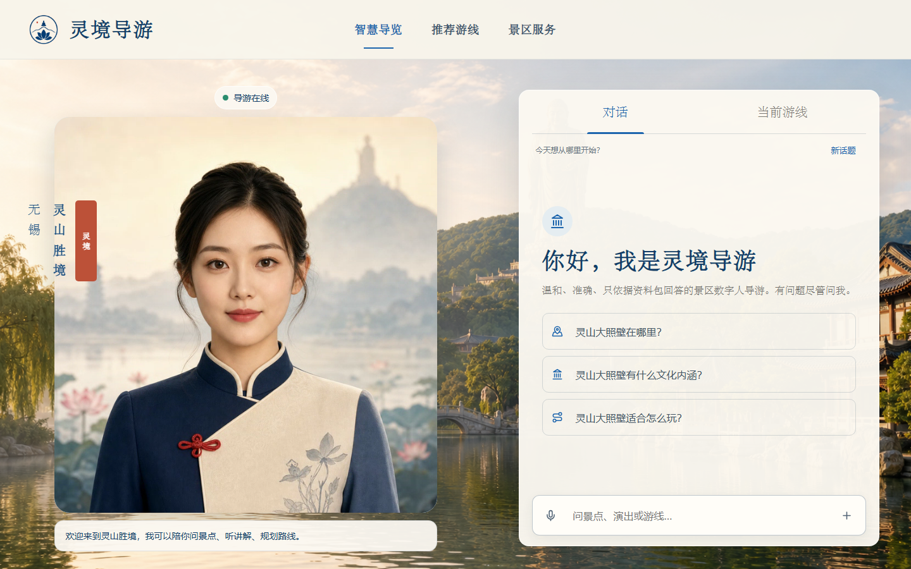
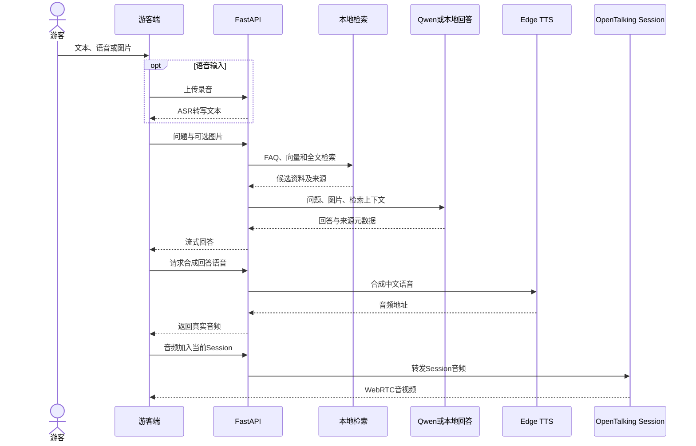
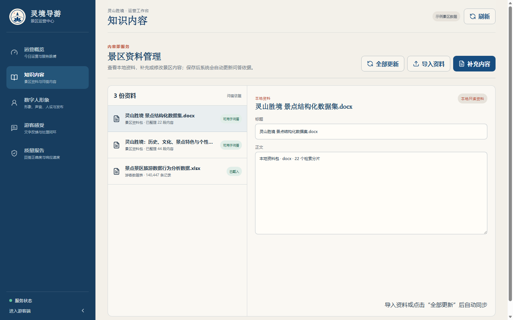
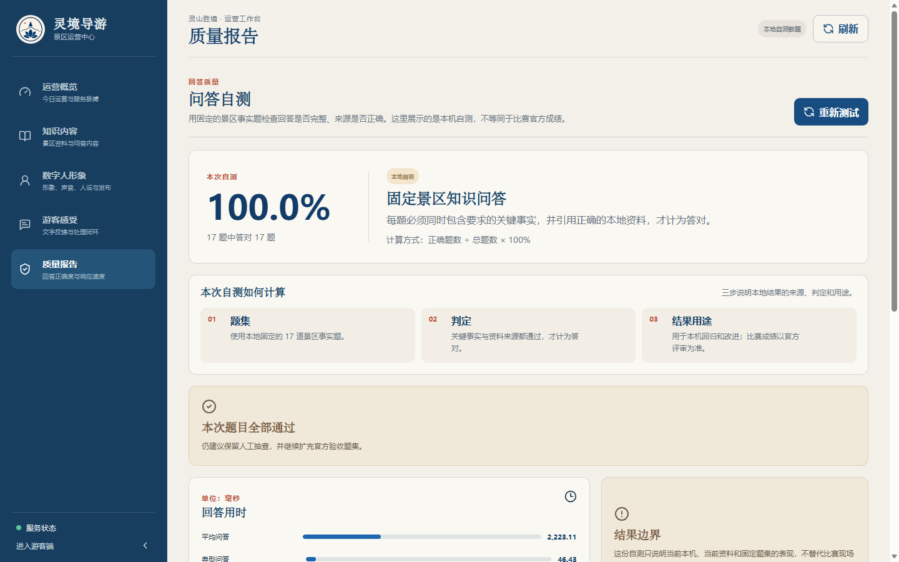
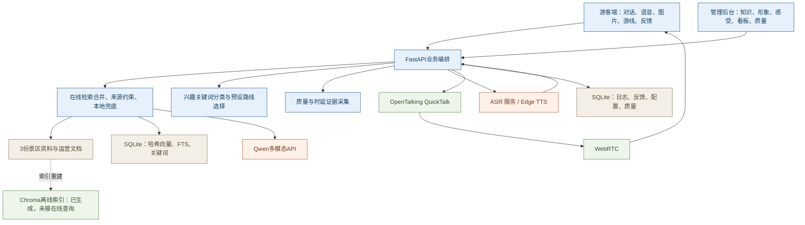

# 灵境导游

## 面向智慧景区的多模态 AI 数字人导览系统

### 产品总体设计文档（评审版）

> 封面图由 imagegen 根据项目数字人形象生成，只用于呈现场景气质，不是系统截图，也不作为功能证据。真实界面从“评委速览”开始展示。

| 文档项 | 内容 |
| --- | --- |
| 版本 | V2.0（评审版） |
| 日期 | 2026 年 7 月 16 日 |
| 示范景区 | 无锡灵山胜境 |
| 交付形态 | 游客 Web 端、管理后台、本地知识库、AI 与数字人服务 |
| 主要技术 | Next.js、React、FastAPI、SQLite、Qwen、Edge TTS、OpenTalking QuickTalk、WebRTC；Chroma 已生成离线索引 |
| 证据口径 | 代码与本地报告能证明的写“已实现/已实测”；比赛现场或专家才能判断的写“待验收” |

---

## 目录

- [0. 评委速览](#0-评委速览)
- [1. 赛题理解与产品边界](#1-赛题理解与产品边界)
- [2. 功能完整度与功能证据](#2-功能完整度与功能证据)
- [3. 技术架构、自研边界与创新](#3-技术架构自研边界与创新)
- [4. 测试、性能与证据登记](#4-测试性能与证据登记)
- [5. 行业价值与使用体验](#5-行业价值与使用体验)
- [6. 部署、安全与异常处理](#6-部署安全与异常处理)
- [7. 演示与答辩设计](#7-演示与答辩设计)
- [8. 已知限制与提交前门槛](#8-已知限制与提交前门槛)
- [附录](#附录-a模块数据与接口摘要)

---

# 0. 评委速览

## 0.1 一句话说明

游客可以在手机或景区终端上说话、打字或上传图片。高置信度常见问题由本地 FAQ 直接回答；其余问题先检索景区资料，必要时由 Qwen 组织回答。来源元数据随回答返回并写入日志，回答再交给 Edge TTS 和 OpenTalking QuickTalk 生成语音及 WebRTC 数字人画面。景区运营人员在后台维护知识、形象和声音，查看问答、评分与反馈。游客端目前还没有单独展示来源卡片。

这份文档把“已经做出来的功能”和“还需要现场证明的指标”分开写。

## 0.2 对照评分表

| 评分项 | 分值 | 已交付内容 | 最直接证据 | 评审状态 |
| --- | ---: | --- | --- | --- |
| 功能完整度 | 40 | 文本/语音/图片入口、景区问答、语音与数字人、兴趣游线、知识/形象/反馈/看板后台 | 图 1—图 7、游客与后台审计脚本 | 主体已实现；真实语音全链路仍待 30 次现场采样 |
| 技术与创新性 | 30 | Qwen + 本地 RAG、Session 复用、QuickTalk + WebRTC、质量证据采集 | QA-FROZEN、QA-LOCAL-SET2-R3、RTC-20260715 | 本地 RAG 与数字人单链路已有证据；端到端目标未通过 |
| 行业实用与体验 | 20 | 户外友好布局、字幕、兴趣游线、单图换形象、反馈处理、能力降级 | 手机截图、后台截图、现场操作 | 可演示；7×24、高并发、生产安全和自然度不作为已完成结论 |
| 文档质量 | 10 | 需求—实现—证据—边界矩阵、演示脚本、部署手册、报告路径 | 本文及附录证据索引 | 可复核 |

## 0.3 四组关键数字

| 数据 | 含义 | 不能说明什么 |
| --- | --- | --- |
| 3 个源文件（2 份问答资料、1 份运营样本）、22 个景点、66 个分片、113 条 FAQ | 本地资料包的当前导入规模 | 不等于回答一定正确 |
| 固定题集 17/17 | 2026-07-13 本地固定题集全部通过 | 不是比赛官方准确率 |
| 第二套本地题集 v1 第 3 次回归为 28/30 | 同一 30 题先后得到 15/30、23/30、28/30；第 3 次准确率 93.33%，请求成功率 100% | 与固定题集规范化问题重合为 0，但题目已在前两次运行中暴露，不能称为独立留出或盲测 |
| WebRTC 首帧 755.5 ms；音频上传到可见嘴部运动 2927.1 ms | 当前样本中数字人链路能输出视频并出现嘴部运动 | 不等于完整语音问答小于 5 秒，也不等于专家自然度评分 |

## 0.4 三项待现场验收

1. **完整语音问答小于 5 秒尚未证明。** 旧报告为 17738.99 ms，且缺少 ASR 与首个可见口型，measurement_complete=false。新的 30 次真人语音 P95 报告还没有生成。
2. **数字人自然度尚未评分。** 当前证据能证明视频轨、连续帧和嘴部变化，不能代替专家对口型同步、表情和整体自然度的判断。
3. **图片多模态缺少独立样本集。** 图片输入、接口和代码路径已经实现，但还没有单独的图片识别准确率报告。

本文后续的“已实现”“已实测”和“待验收”都按上述口径使用。

## 0.5 当前游客端

**图 1　游客端桌面首页（2026-07-16 本地运行截图）。** 页面展示数字人舞台、字幕、对话区、语音入口和当前游线入口。静态截图用于证明界面与功能入口，不用于证明动态口型。

---

# 1. 赛题理解与产品边界

## 1.1 从一个真实任务出发

旺季游客站在景点前，最常见的需求不是“播放下一段录音”，而是：

- 这个景点为什么重要；
- 今天什么时候有演出；
- 我只有半天，应该怎么走；
- 我带着老人或孩子，哪些内容更合适；
- 现场看到的建筑是什么。

人工导游很难覆盖所有游客，录音设备又无法追问。景区后台同时缺少一条清楚的反馈路径：游客问了什么、哪些回答不理想、哪些资料需要更新，往往只能靠零散投诉判断。

本项目把这两个任务放在同一套系统里：

    游客提问
      → 本地资料检索
      → 返回回答并记录来源
      → 语音与数字人讲解
      → 评分和文字反馈
      → 后台处理与知识更新
      → 重新测试

## 1.2 用户和使用场景

| 用户 | 主要任务 | 当前入口 |
| --- | --- | --- |
| 游客 | 问景点、听讲解、看路线、提交反馈 | 手机或景区终端浏览器 |
| 景区运营人员 | 维护资料、调整数字人、处理反馈、看服务数据 | 管理后台 |
| 系统维护人员 | 检查模型、语音、数字人和索引状态 | 健康接口、日志、质量报告 |
| 比赛评委 | 核对功能是否真实、指标是否有证据、边界是否诚实 | 演示视频、本文、报告文件 |

## 1.3 比赛版与生产版的边界

| 项目 | 当前比赛版 | 生产部署还需要 |
| --- | --- | --- |
| 运行环境 | 本机或受控局域网演示 | 高可用、监控、备份、容量规划 |
| 管理权限 | 受控环境直接访问 | 登录、角色权限、审计 |
| 网络安全 | 密钥仅在服务端，前端同源代理 | HTTPS、限流、WAF、上传安全扫描 |
| 数据合规 | 当前问答日志保存 User-Agent 及其哈希，只适用于受控演示 | 改用随机会话 ID；补隐私告知、保留期限、删除机制和第三方数据协议 |
| 服务时间 | 本机受控演示 | 7×24 是生产目标，不作为当前已验证成果 |
| 定位 | 已有精度、状态契约和数学测试，尚未接入游客主流程 | 真实景点坐标、游客端接入和户外测试 |
| 并发 | 单机演示链路 | 多游客压测和资源隔离 |

## 1.4 设计准则及其验收含义

| 准则 | 在本项目中的具体含义 |
| --- | --- |
| 回答可信 | 后端响应和日志保留资料来源；游客端来源卡片待补；找不到依据时不编造时间、票价和位置 |
| 游客易用 | 主要触控目标约 44 像素以上；手机端保留字幕和输入入口 |
| 后台易维护 | 运营人员无需理解模型 ID；知识可按文档更新，形象可通过一张图发布 |
| 失败可继续 | 语音、模型、数字人或定位单项异常时，尽量保留文本和已有游线 |
| 指标可复核 | 报告保存题集版本、实际服务提供方、时延、环境及 official_evaluation 标识 |

---

# 2. 功能完整度与功能证据

## 2.1 总体完成度

| 需求 ID | 比赛要求 | 当前实现 | 证据 | 边界 |
| --- | --- | --- | --- | --- |
| V-01 | 文本输入 | 连续提问界面、流式回答 | 图 1；flow-audit | 当前每轮独立推理，尚未把历史消息送入模型 |
| V-02 | 语音输入 | 浏览器录音、ASR 适配和转写接口 | 代码、接口、后端测试；LIVE-20260716 | 现有实测只是 Edge TTS → Vivo ASR 单条回转，不是真人录音；真实 ASR 到口型的 30 次全链路报告待补；比赛链路必须禁用模拟转写 |
| V-03 | 图片输入 | 图片和问题共同进入 Qwen 问答链路 | test_chat_stream、goal-audit | 图片理解依赖 Qwen；本地兜底不具备视觉识别，独立图片测试集待补 |
| V-04 | 景区问答 | FAQ、SQLite 哈希向量、FTS/关键词检索、Qwen 或本地资料回答 | QA-FROZEN、QA-LOCAL-SET2-R3 | 来源元数据已返回和记录，但游客端未单独呈现；官方准确率待测；Chroma 在线查询未接通 |
| V-05 | 语音、口型与表情 | Edge TTS → QuickTalk → WebRTC；前端有 friendly/listening/thinking/speaking 四类交互状态样式 | RTC-20260715 | 报告只证明默认头像出现嘴部变化；尚无随回答情绪切换面部表情的驱动证据，音画同步和整体自然度待专家评价 |
| V-06 | 个性化推荐 | 兴趣关键词匹配 4 套规则预设，每条最多 5 个节点 | 图 3；route-plan 接口 | 没有起点、GPS、实时客流、时长和体力约束；点位为路线示意 |
| V-07 | 情感互动 | 可配置人设与讲解风格，前端显示友好交互状态，回答后支持星级和文字反馈 | 图 2；feedback 接口 | 未做游客语音/面部的多模态情绪识别，也未做语义驱动的面部表情 |
| A-01 | 知识管理 | 基础资料只读；运营文档增改、软删、重建索引 | 图 5；admin-audit | 已实现 |
| A-02 | 数字人管理 | 单图形象、名称、人设、声音、服装版本字段、试听和发布页面与接口 | admin-audit、后端资产测试 | 最新 RTC 报告验证的是默认头像；自定义头像完整驱动待现场验证；服装目前是配置字段/预设标签，视觉换装未单独验收 |
| A-03 | 游客感受度 | 星级、文字、情感标签、主题、建议和处理状态 | 图 6 | 规则兜底；不作专业舆情或心理判断 |
| A-04 | 数据概览 | 服务标识数、问答量、热门问题、满意度和趋势 | 图 4 | “服务人次”按 User-Agent 哈希粗略去重，同型号浏览器会合并；只作演示，不等同独立游客或真实客流 |
| N-00 | 至少 1 个多模态大模型 | 当前配置 `qwen3.5-omni-plus-2026-03-15`（环境变量可更换），走兼容 OpenAI 接口规范的文本/图片消息路径 | qwen_client、test_chat_stream | 图片效果待真实样本验证；Qwen 不可用时只能按文本和本地资料回答 |
| N-01 | 准确率不低于 90% | 固定题集 17/17；第二套题集第 3 次回归 28/30 | 两份 QA 报告 | 不是官方成绩；第二套题集不是独立留出测试 |
| N-02 | 语音问答小于 5 秒 | 已实现采集器和严格判定 | E2E-20260712 | 当前未通过完整验收 |
| N-03 | 稳定、无长时间无响应 | 2026-07-16 通过 141 项后端测试和 5 项静态审计 | DOC-REVIEW-20260716 | 尚无并发、长稳和故障注入报告 |
| O-01 | GPS 复杂场景 | 定位精度、拒绝、弱信号和手动地标契约 | 定位数学与类型测试 | 只算扩展基础 |

## 2.2 游客交互流程

### 三种输入的证据强度

| 输入 | 已完成 | 当前证据 | 本文采用的表述 |
| --- | --- | --- | --- |
| 文本 | 输入、检索、流式回答、来源元数据、日志 | 固定题集、第二套本地题集、游客流程审计 | 已实现；当前每轮独立推理，游客端未渲染来源卡片 |
| 语音 | 录音入口、ASR 接口、转写后问答、TTS | 接口与测试；Edge TTS → Vivo ASR 单条回转样本；数字人报告从音频上传后开始 | 已实现接口；没有真人 ASR 样本集，演示时不得用模拟结果冒充识别 |
| 图片 | 上传入口、多模态请求字段、Qwen 图片消息 | 单元/契约测试 | 已实现代码路径；图片准确率未单独评测 |

## 2.3 景区知识问答

### 本地知识

| 来源 | 进入问答知识 | 用途 |
| --- | --- | --- |
| 灵山胜境 景点结构化数据集.docx | 是 | 景点名称、位置、参数、特色、开放信息 |
| 灵山胜境：历史、文化、景点特色与个性化游览指南.docx | 是 | 历史文化、讲解重点、游览建议 |
| 景点景区旅游数据行为分析数据.xlsx | 否 | 运营分析样本；不冒充景点问答资料 |

2026-07-16 重建结果为 3 个来源、22 个景点、66 个分片、113 条 FAQ。Chroma 已生成 66 项索引且状态为 ok，但当前在线查询没有调用 Chroma。

### 检索顺序

1. 高置信度常见问题先走 FAQ 快速通道；
2. 一般问题对 SQLite 中保存的哈希向量计算相似度；
3. SQLite FTS 和关键词得分参与合并排序；
4. 候选资料去重、排序后进入 Qwen；
5. 回答保存实际服务提供方和资料来源；
6. Qwen 不可用时返回本地资料型回答。

Chroma 当前用于生成和检查独立索引，还没有进入在线查询路径。答辩中不能把 `status=ok` 解释为“问答正在使用 Chroma 召回”。

这里的团队工作是资料清洗、切分、召回合并、来源返回、失败兜底和评测；Qwen、Chroma 本身不是团队训练的模型。

**图 2　游客端实际问答结果（2026-07-16 本地运行截图）。** 浏览器从首页点击“灵山大照壁在哪里”，等回答完成后抓取该画面。截图能证明回答、追问和评分入口进入同一流程；回答正确率仍以题集报告为准。

## 2.4 兴趣游线

**图 3　兴趣游线界面。** 当前实现根据兴趣关键词选择亲子、文化、自然或经典半日线，每条最多展示 5 个资料包景点，并保留“讲这一站”入口。图中是实际界面结果；底图、点位和连线均为路线示意，不代表真实 GPS 导航。

当前推荐能区分“偏历史文化还是自然风光”这类兴趣，但本质上是规则分类后选择预设路线。比赛答辩中可称为“兴趣驱动的推荐游线”，不能称为起点感知、实时规划或综合客流、天气、体力和无障碍条件的最优路线。

## 2.5 数字人讲解

当前实时链路：

    回答文本
      → Edge中文TTS
      → OpenTalking Session音频入队
      → QuickTalk常驻Worker
      → WebRTC持续音视频

与旧整段 MP4 方案相比，Session 复用避免每轮重新加载模型和形象。当前默认配置为 QuickTalk、720×720、25 fps 目标值、约 2.4 秒的 60 帧源素材、28 帧切片和 500 ms 渲染块，演示目标硬件为 RTX 4060 8GB。最新 RTC 报告只覆盖默认头像的一次本地样本，不外推到其他头像或硬件。

前端会根据 friendly、listening、thinking、speaking 四种状态改变状态点、边框和光效。这是交互状态提示，不是由回答语义或游客情绪驱动的面部表情。现阶段不能把它表述为“表情同步”。

降级顺序为：

    session → remote → legacy_mp4 → audio_only

- session 是已联调主链路；
- remote 只是扩展位，未部署；
- legacy_mp4 用于兼容，不是实时主方案；
- audio_only 保留真实语音和字幕，静态图或 CSS 动画不算口型证据。

## 2.6 管理后台

### 运营概览

**图 4　运营概览。** 页面展示实时问答、服务趋势、热门问题和满意度。示例景区数据、本地自测数据和实时交互数据使用不同标签。页面中的“服务人次”按 User-Agent 哈希粗略去重，只能用于演示趋势。

### 知识内容

**图 5　知识内容管理。** 三份基础资料保持只读；运营人员可以补充内容并重建问答依据。内容版本和索引版本分别记录，重建失败时不删除旧的可用索引。

### 游客感受

**图 6　游客感受与处理。** 页面把星级、文字、情感标签、关注点、建议和处理状态放在同一工作区。情感分析支持规则兜底，结果用于运营排序，不用于判断个人心理状态。

### 质量报告

**图 7　固定题集本地自测页面。** 页面明确写明“本机自测，不等同于比赛官方成绩”，并展示题集、判定规则、结果用途和响应时间。

## 2.7 异常情况下仍能完成什么

| 故障 | 降级动作 | 保留的游客任务 |
| --- | --- | --- |
| Qwen 未配置或超时 | 文本问题使用本地检索回答；图片问题提示改用文字描述 | 继续文本问答；本地兜底不冒充图片识别 |
| SQLite 哈希向量检索异常 | 保留 FTS/关键词检索 | 继续问答 |
| 浏览器拒绝麦克风权限 | 前端提示改用文本 | 继续提问 |
| 真实 ASR 服务失败 | 当前仍有预置模拟文本继续进入问答的风险；比赛模式必须改为拒绝模拟转写并提示文字输入 | 安全降级尚未验收，列为 P0 |
| TTS 失败 | 只显示文字和字幕 | 阅读答案 |
| 数字人 Session 不可用 | audio_only 或纯文本 | 听语音或看字幕 |
| 定位不可用 | 当前游客主流程仍按兴趣选择预设路线，不显示虚假位置 | 继续查看路线示意 |
| 知识重建失败 | 保留旧索引版本 | 已发布问答不中断 |

---

# 3. 技术架构、自研边界与创新

## 3.1 总体架构

| 颜色 | 含义 |
| --- | --- |
| 蓝色 | 团队开发的前后端、编排、游线和证据工具 |
| 绿色 | 使用的开源组件；图中 Chroma 明确标出当前接入边界 |
| 橙色 | 外部模型或语音服务 |
| 米色 | 本地资料和业务数据 |

图中以颜色区分团队实现、开源组件、外部服务和本地数据。团队贡献集中在景区业务编排、知识治理、实时 Session 接入、降级路径和证据采集；第三方基础模型不计入自研成果。

## 3.2 关键技术选择

| 问题 | 选择 | 原因 | 当前代价 |
| --- | --- | --- | --- |
| 景区事实容易幻觉 | 本地 RAG + 来源返回 | 回答可以回到具体资料 | 准确率受切分、召回和资料质量影响 |
| 高频问题响应慢 | FAQ 高置信度快速通道 | 减少不必要的大模型调用 | 相似问题可能误命中，需严格阈值 |
| 数字人每轮加载慢 | 常驻 Session + 工作进程缓存 | 连续播报复用模型和形象 | 占用持续 GPU 资源 |
| 整段视频等待长 | WebRTC 持续流 | 可以先建连接再送音频 | 网络和浏览器媒体状态更复杂 |
| 外部服务可能中断 | 服务提供方适配 + 本地兜底 | 单项故障不阻断全部任务 | 不同服务提供方的质量并不完全一致 |
| 研发数据容易被夸大 | 题集版本、official 标识、逐样本时延 | 评委可以复核边界 | 仍需要现场真人样本 |

## 3.3 可称为项目创新的部分

| 基线问题 | 团队改造 | 已有证据 | 限制 |
| --- | --- | --- | --- |
| 通用大模型不熟悉景区细节 | 资料解析、分片、FAQ/SQLite 哈希向量/全文混合检索、来源回传、本地兜底 | 3/22/66/113；两份本地 QA 报告 | 官方准确率未测；Chroma 在线查询未接通 |
| 数字人按问题生成整段视频 | 把 OpenTalking 接入持续 Session，回答音频直接入队，WebRTC 输出 | 首帧 755.5 ms；126/126 speaking 帧唯一 | 完整问答仍未达到证据门槛 |
| 管理后台只展示数据 | 知识修改、索引版本、反馈处理和质量回归共用一套业务数据 | 图 5—图 7；后台审计 | 处理和回归由运营人员人工触发，尚未形成自动闭环，也无正式试点 |
| 性能报告容易重复计算阶段耗时 | 浏览器统一时钟，取首个有效音频与首个可见口型的较晚值 | benchmark 采集器与 strict check | 30 次现场样本未生成 |

RAG、WebRTC、QuickTalk 和 Qwen 都是已有技术。本文只把“面向景区的组合改造、业务约束和证据方法”作为项目贡献。

## 3.4 数据设计摘要

| 数据组 | 主要实体 | 用途 |
| --- | --- | --- |
| 基础知识 | source_files、attractions、knowledge_chunks、faqs | 资料、景点、分片、FAQ |
| 运营知识 | knowledge_documents | 内容版本、索引版本、软删除 |
| 数字人 | digital_human_profiles、digital_human_active | 形象、声音、人设、发布状态 |
| 交互与反馈 | qa_logs、feedback | 问答、来源、评分、情感、处理状态 |
| 指标与质量 | dashboard_metrics、quality_runs、reports/quality | 运营聚合、题集与时延报告 |

---

# 4. 测试、性能与证据登记

## 4.1 证据编号

| 证据 ID | 日期 | 内容 | 结果 | 文件 |
| --- | --- | --- | --- | --- |
| KB-20260716 | 2026-07-16 | 资料导入与知识重建清单 | 导入 3 个源文件；其中 2 份问答资料形成 22 个景点、66 个分片、113 条 FAQ，XLSX 只作运营样本 | backend/storage/exports/knowledge_manifest.json |
| LIVE-20260716 | 2026-07-16 | 受控服务回转检查 | Edge TTS → Vivo ASR 单条回转通过；音频非真人录制 | reports/live-service-check-latest.json |
| QA-FROZEN | 2026-07-13 | 固定 17 题 | 17/17，100%，非官方 | reports/quality/frozen-qa-latest.json |
| QA-LOCAL-SET2-R3 | 2026-07-13 | 第二套 30 题第 3 次完整回归；与固定题集规范化问题重合为 0 | 28/30，93.33%，非官方、非独立留出 | reports/quality/hidden-qa-20260713-095616.json reports/quality/hidden-qa-20260713-100653.json reports/quality/hidden-qa-20260713-101309.json backend/tests/test_hidden_scenic_qa_fixture.py |
| RTC-20260715 | 2026-07-15 | 默认头像的 QuickTalk + WebRTC 实际音频驱动 | 六项检查通过，嘴部有可见变化；单次本地样本 | reports/quality/opentalking-webrtc-latest.json |
| E2E-20260712 | 2026-07-12 | 旧端到端报告 | 17738.99 ms，数据不完整，未通过 | reports/quality/e2e-latency-latest.json |
| UI-20260716 | 2026-07-16 | 游客端和后台本地运行截图 | 图 1—图 7、图 9 | docs/assets/product-overall-design、docs/assets/manual/07-tourist-answer.png |
| DOC-REVIEW-20260716 | 2026-07-16 | 文档结构、证据数字、类型、测试和 5 项静态审计 | 141 项后端测试通过；11 个图片引用存在；未发现陈旧指标或营销套话 | reports/product-design-document-review-20260716.md |

## 4.2 问答结果

| 题集 | 通过 | 准确率 | 请求成功率 | 平均 | 中位 | P95 | 解释 |
| --- | ---: | ---: | ---: | ---: | ---: | ---: | --- |
| 固定题集 | 17/17 | 100% | 100% | 2223.11 ms | 46.43 ms | 6825.17 ms | 本地回归集，不是官方测试 |
| 第二套本地题集 v1，第 3 次回归 | 28/30 | 93.33% | 100% | 6287.52 ms | 5075.67 ms | 15402.35 ms | 6 类、每类 5 题；21 题走 Qwen，9 题走 FAQ 快速通道；非官方 |

### 第二套本地题集的正确口径

第二套本地题集 v1 有 30 题，分为 6 类，每类 5 题；其规范化问题与固定 17 题重合为 0。同一题集先后完整运行三次：09:56 为 15/30，10:06 为 23/30，10:13 为 28/30。第一次运行后，30 道题已经全部暴露，因此 28/30 只能作为第 3 次历史回归结果，不能作为独立留出成绩。

- 28/30 可以写成“2026-07-13 第二套题集第 3 次回归结果”；
- 不能写成“独立盲测 93.33%”或“首次运行 28/30”；
- 后续两题定向通过不能写成 30/30；
- 当前版本若要提供独立结果，应新建团队未接触的第三套题集 v2；
- 比赛最终准确率仍以官方测试集为准。

## 4.3 数字人联调结果

| 指标 | 最新结果 |
| --- | ---: |
| 创建 Session 到首个视频帧 | 755.5 ms |
| 音频上传接口耗时 | 173.0 ms |
| 音频上传到 speaking | 185.5 ms |
| 音频上传到可见嘴部运动 | 2927.1 ms |
| speaking 采样帧 / 唯一帧 | 126 / 126 |
| 嘴部帧差平均 / P95 / 峰值 | 0.6294 / 3.1925 / 7.5217 |

<table>
  <tr>
    <td></td>
    <td></td>
  </tr>
  <tr>
    <td align="center">音频驱动前</td>
    <td align="center">嘴部变化峰值</td>
  </tr>
</table>

**图 8　WebRTC 联调证据帧。** 两张图片和帧差报告证明画面在说话期间发生变化。仅凭这组图不能判断音画同步精度或观看自然度，最终仍需视频和专家评价。

## 4.4 三类时延不要混用

| 时延 | 测的是什么 | 当前情况 | 能否证明小于 5 秒 |
| --- | --- | --- | --- |
| QA 请求时延 | 文本问题到完整回答 | 固定 P95 6825.17 ms；第二套题集第 3 次 P95 15402.35 ms | 不能 |
| 数字人组件时延 | Session/音频上传到视频或嘴部变化 | 首帧 755.5 ms；音频到嘴部 2927.1 ms | 不能，缺 ASR 与问答 |
| 完整语音问答时延 | 录音结束到首个有效音频和可见口型 | 旧报告不完整；30 次新样本未生成 | 当前不能 |

严格端到端定义为：

    end_to_end_ms =
      max(first_valid_audio_ms, first_visible_mouth_ms)
      - recording_stopped_at

阶段值只用于定位瓶颈，不相加并行耗时。本项目内部的严格验收口径是：30 条真人样本全部完整，使用真实服务提供方和 `session_stream`，成功率 100%，且 P95 小于 5 秒。赛题原文只给出“如语音问答延迟小于 5 秒”的示例，并未规定 30 条样本或 100% 成功率。

## 4.5 六层测试

| 层级 | 检查内容 |
| --- | --- |
| 单元测试 | 数据库、检索、语音、配置、反馈、数字人桥接和定位数学 |
| 类型/契约 | TypeScript、API Schema、前后端字段和状态 |
| 页面审计 | 游客流程、后台、文案、启动脚本和比赛目标 |
| 问答质量 | 固定题集、第二套本地题集、关键事实和资料来源 |
| 真实媒体 | Session、WebRTC、音视频轨、连续帧和嘴部区域 |
| 现场验收 | 30 次真人语音、连续操作、最终视频和专家自然度 |

---

# 5. 行业价值与使用体验

## 5.1 已能演示的价值

| 对象 | 目前可以看到的变化 |
| --- | --- |
| 游客 | 可以连续提问景区问题、听中文讲解、查看兴趣游线；来源卡片仍待补 |
| 运营人员 | 可以查看三份基础资料、补充内容、发布形象、处理反馈、看本地质量报告 |
| 系统维护人员 | 可以区分 Qwen、FAQ、本地检索、TTS 和数字人实际状态 |
| 评委 | 可以沿证据 ID 回到报告和截图，不依赖口头说明 |

“降低多少人工成本”“提升多少满意度”目前没有景区试点数据，本文不提供估算值。它们是后续试点需要验证的业务指标。

## 5.2 户外与手机体验

**图 9　390×844 真实 CSS 视口截图。** 字幕、数字人、对话和输入入口保持在单列阅读顺序中，没有用裁切后的桌面页面冒充手机适配。

当前体验规则：

- 主要触控目标约 44 像素以上；
- 手机端不隐藏字幕；
- 状态不能只靠颜色表达；
- 支持 prefers-reduced-motion；
- 语音权限拒绝时可回到文本；
- 定位不可靠时不猜位置；
- 当前未宣称通过正式 WCAG 等级认证。

## 5.3 后台维护成本

运营人员更换数字人的操作被压缩为四步：

1. 上传一张有授权的正面或轻微侧面半身图；
2. 设置显示名称和人设；
3. 选择中文声音并试听；
4. 保存并应用。

QuickTalk 素材准备和预热由后台发起。页面与接口已经实现，但最新 RTC 报告使用的是默认头像；自定义头像从上传、准备、预热到真实驱动仍需现场走完。后台发布接口也不能代替“预热成功”的验收。

## 5.4 迁移到其他景区

可以复用的部分：

- 游客与后台页面；
- 知识解析和索引流程；
- Qwen、语音和数字人适配层；
- 反馈、数据看板和质量报告；
- 启动、健康检查和降级逻辑。

必须重新准备的部分：

- 景点资料、FAQ 和标准测试集；
- 经过核验的地图、路线和坐标；
- 有授权的数字人形象和声音；
- 当地运营规则、票务、演出和安全提示；
- 内容审核和隐私制度。

因此“迁移”是减少重复开发，不是零成本复制。

---

# 6. 部署、安全与异常处理

## 6.1 当前部署

| 组件 | 当前方案 |
| --- | --- |
| 前端 | Next.js 15、React 19、TypeScript |
| 后端 | FastAPI、SQLite |
| 在线检索 | SQLite 哈希向量相似度 + FTS/关键词；Chroma 已建离线索引但未接在线查询 |
| 大模型 | Qwen，兼容 OpenAI 接口规范 |
| TTS | Edge 中文神经网络语音为当前主线 |
| 数字人 | OpenTalking QuickTalk + WebRTC |
| 目标演示硬件 | RTX 4060 8GB；720×720；25 fps 目标配置 |
| 默认端口 | Web 3000、API 8000、Session 8210；Web/API 可在占用时选择邻近端口，Session 端口需预先确保可用 |

启动脚本先检查配置和端口，启动 Session 后让形象预热在后台继续，再启动 FastAPI 和 Next.js。服务健康、工作进程就绪和真实 WebRTC 视频分别验收，不能只看健康接口返回 ok。

## 6.2 安全边界

已经做到：

- 模型和语音密钥只留在服务端环境变量；
- 浏览器通过同源 /api 代理访问；
- 报告、截图和提交包不写入密钥；
- 基础资料只读，运营文档软删除。

仍有缺口：头像和 Session 音频已有部分格式或大小限制，但知识文件、聊天图片和 ASR 上传尚未形成统一、完整的后端校验；问答日志还保存原始 User-Agent，并用其哈希估算服务标识数。比赛版只能在受控输入下演示，不能据此宣称具备生产级上传安全或匿名访客统计。

公网部署前必须补：

- 管理员登录和角色权限；
- HTTPS、限流和上传恶意内容检查；
- 隐私告知、数据保留期限和删除流程；
- 随机会话 ID，停止用 User-Agent 哈希代表游客；
- 日志脱敏、审计、备份与恢复；
- 第三方模型的数据处理协议核查。

## 6.3 现场故障处置

| 现场情况 | 操作 |
| --- | --- |
| 语音暂时不可用 | 停止语音链路并改用文本；不播放模拟音频，也不把预置模拟文本当成真实转写 |
| 数字人未就绪 | 保留语音和字幕，明确“流式驱动未就绪”；不把海报称为实时口型 |
| Qwen 超时 | 使用已验证问题或本地检索回答，并说明外部网络影响 |
| 游线未出现 | 使用明确兴趣句式重新请求；不伪造路线截图 |
| 后台数据混淆 | 检查“实时交互/示例景区/本地自测”标签 |
| 端口冲突 | 读取 runtime-ports.json 打开实际地址 |

---

# 7. 演示与答辩设计

## 7.1 前三分钟必须回答的五个问题

| 时间 | 演示 | 评委判断 |
| --- | --- | --- |
| 0:00–0:20 | 打开本文 0.2 评分对照页或答辩 PPT 结论页，说明已实现、已实测、待验收 | 团队是否清楚边界 |
| 0:20–1:20 | 真人语音提问，展示转写与回答，并从后台日志核对来源，再展示 TTS、WebRTC 和字幕 | 核心链路是否真实 |
| 1:20–1:50 | 上传一张景点图片，展示回答和不确定性 | 多模态是否超过文本聊天 |
| 1:50–2:25 | 选择一种兴趣游线并“讲这一站” | 规则推荐和连续任务是否可用 |
| 2:25–3:00 | 后台展示知识或反馈处理，再看质量报告 | 管理端是否参与实际运营 |

如果 30 次 P95 尚未完成，应在第一页主动说明，不能在口头表达中暗示“所有问答都在 5 秒内”。语音识别失败时必须切到文本，不得让模拟转写继续进入问答；图片演示前先确认 Qwen 可用，现场结果也不能替代独立图片测试集。

## 7.2 七分钟完整脚本

开场先用一句话落到产品：“灵境导游让游客用语音、文字或图片提问，并把本地景区知识、中文讲解和数字人画面接到同一次服务里。”随后再进入证据边界。

| 时间 | 内容 | 要展示的证据 |
| --- | --- | --- |
| 0:00–0:20 | 作品定位与证据边界 | 本文 0.2 或答辩 PPT 结论页 |
| 0:20–1:20 | 真人语音问答 | 转写、回答、后台来源记录、语音、口型 |
| 1:20–1:50 | 图片问答 | 原图、问题、回答、不确定性 |
| 1:50–2:35 | 兴趣游线 | 4 套预设中的路线、示意站点、讲这一站 |
| 2:35–3:25 | 知识内容 | 三份资料、分片、运营文档 |
| 3:25–4:10 | 单图数字人 | 上传、声音试听、准备状态；仅在预热成功后展示真实驱动 |
| 4:10–4:55 | 游客感受 | 情感趋势、建议、处理状态 |
| 4:55–5:35 | 运营概览 | 数据来源、热门问题、满意度 |
| 5:35–6:25 | 质量报告 | 固定 17 题、第二套题集三次回归轨迹、时延边界 |
| 6:25–7:00 | 三项已证与三项待验收 | 结论页 |

## 7.3 答辩可说与不可说

可以说：

- “资料包导入 3 份文件，其中 2 份进入问答知识库，形成 22 个景点、66 个分片、113 条 FAQ；XLSX 只作运营样本。”
- “固定 17 题本地回归为 17/17；第二套 30 题第 3 次回归为 28/30，均不是官方成绩。”
- “最新 WebRTC 联调中，126 个 speaking 采样帧全部唯一，音频上传到可见嘴部变化为 2927.1 ms。”
- “端到端小于 5 秒仍待 30 次真人语音样本验证。”

不可说：

- “比赛官方准确率已经达到 100% 或 93.33%。”
- “所有语音问答都能在 5 秒内完成。”
- “像素帧差证明数字人已经自然。”
- “第二套题集是独立盲测 93.33%，或者修复后已经是 30/30。”
- “当前系统已具备 7×24、高并发和生产级安全。”
- “路线已经综合实时天气、拥堵和游客体力。”

---

# 8. 已知限制与提交前门槛

## 8.1 P0：直接影响核心评分

1. **完成 30 次真人语音端到端采样。** 没有这组数据，就不能申报小于 5 秒。
2. **补真实 ASR 主链路说明。** 明确比赛机器使用哪个服务提供方，记录识别成功率和失败样本，并让比赛模式在真实 ASR 失败时拒绝模拟文本。
3. **准备数字人连续视频。** 让专家看音画同步、表情和多轮连续讲解，而不是只看两张帧差图。
4. **补面部表情驱动或明确降级口径。** 当前四类状态只改变前端样式；没有语义或情绪驱动的面部表情证据时，不申报“表情同步”。

## 8.2 P1：提高技术可信度

1. 新建团队未接触的第三套题集 v2，不再把已运行三次的第二套题集当作独立结果；
2. 建立图片问答样本集，至少覆盖正确识别、相似景点和无法判断三类；
3. 在游客回答下展示来源卡片；当前来源元数据只随响应返回并进入日志；
4. 对相同提问下的两类兴趣游线做对照，说明规则分类、路线差异和当前约束；
5. 补数字人形象发布页截图和从上传到可用的耗时，并验证服装预设是否真实改变游客端外观；
6. 同步更新视觉验收报告的时间和文件哈希。

## 8.3 P2：从比赛版走向景区试点

- 管理员认证、权限和审计；
- 真实景点坐标和户外弱网测试；
- 多游客并发与显存容量测试；
- 运营人员使用时长和错误率；
- 游客满意度、人工节省和内容更新时间等试点指标。

## 8.4 结论

目前已有证据支持三点：

1. 游客端和管理后台的主体功能已经落到可操作页面；
2. 本地景区知识能够参与回答，并保留来源和本地质量记录；
3. 默认头像的 QuickTalk + WebRTC 单次本地样本已收到真实音视频轨并产生可见嘴部变化。

目前不能下结论的三点：

1. 比赛官方准确率；
2. 完整语音问答 P95 小于 5 秒；
3. 数字人自然度和生产环境 7×24 稳定性。

---

# 附录 A：模块、数据与接口摘要

## A.1 前端模块

| 模块 | 职责 |
| --- | --- |
| TouristExperience | 输入、会话、语音状态、流式回答、游线和反馈 |
| DigitalHuman | 待机画面、WebRTC、字幕、播报状态和媒体控制 |
| ItineraryPanel | 路线、站点、推荐理由和单站讲解 |
| AdminConsole | 后台导航、数据加载和状态 |
| CompetitionPanels | 知识、数字人、感受度和质量面板 |
| MiniCharts | 趋势、分布和满意度图表 |

## A.2 后端模块

| 模块 | 职责 |
| --- | --- |
| main | FastAPI 启动、游客接口和通用后台接口 |
| ingestion | DOCX/XLSX 解析、清洗、切分和导入 |
| retrieval | FAQ、向量、全文和关键词检索 |
| vector_backends | Chroma、FAISS 等向量后端适配 |
| qwen_client | Qwen，兼容 OpenAI 接口规范 |
| voice | ASR/TTS 服务提供方适配 |
| opentalking_session | Session 生命周期、音频和 WebRTC |
| admin_competition | 知识、形象、反馈、概览和质量接口 |
| quality_evaluation | 题集和质量样本评测 |
| db / schemas | SQLite 和请求响应约束 |

## A.3 接口分组

| 接口组 | 主要路径或用途 |
| --- | --- |
| 问答 | /api/chat、/api/chat/stream |
| 游线 | /api/route-plan |
| 语音 | /api/asr/transcribe、/api/tts/synthesize |
| 数字人 | 能力、Session、音频、WebRTC、中断、事件 |
| 反馈 | /api/feedback、/api/feedback/text |
| 知识 | 文档查询、新增、编辑、软删、重建索引 |
| 数字人管理 | 形象上传、声音试听、预览、发布 |
| 运营与质量 | overview、logs、feedback、quality-runs |

---

# 附录 B：复现与证据路径

## B.1 推荐检查命令

    npm run startup-audit
    npm run typecheck
    npm run flow-audit
    npm run admin-audit
    npm run copy-audit
    npm run goal-audit
    .\.venv\Scripts\python.exe -m unittest discover -s backend\tests -p test_*.py
    npm run build
    npm run live-check

严格比赛检查需要先由浏览器导出 30 条真人语音样本，再运行：

    npm run competition-check

self-check 使用模拟 ASR/TTS，只用于离线回归，不能当作比赛链路证据。

## B.2 主要文件

- README.md：项目概况、启动和能力边界；
- PRODUCT.md：用户与设计原则；
- docs/competition-requirements-audit.md：赛题逐项验收；
- docs/digital-human-setup.md：数字人配置和四层验收；
- docs/demo-runbook.md：演示脚本；
- docs/产品部署和使用手册.md：部署和操作；
- reports/quality：问答、时延和 WebRTC 报告；
- docs/assets/product-overall-design：本文使用的界面截图和封面图；
- docs/assets/manual/07-tourist-answer.png：本地实际问答截图；
- reports/quality/opentalking-webrtc-evidence：WebRTC 嘴部变化证据帧；
- reports/product-design-document-review-20260716.md：本文终审记录。

## B.3 状态词

| 状态 | 含义 |
| --- | --- |
| 已实现 | 当前代码和页面中存在该功能 |
| 已实测 | 有真实服务、数据或媒体报告 |
| 待现场验收 | 工具已准备，但比赛环境样本未产生 |
| 专家评审 | 需要观看和主观评价 |
| 扩展基础 | 只有局部实现，不作为完整功能申报 |
