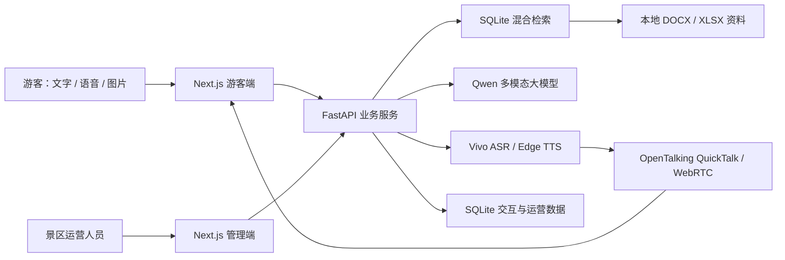
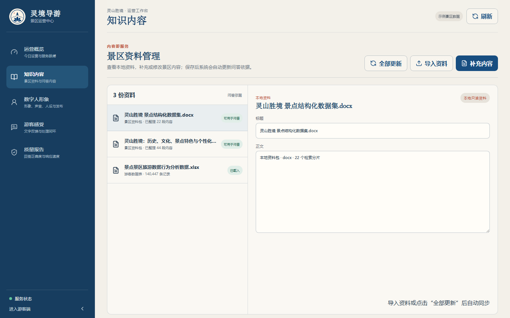
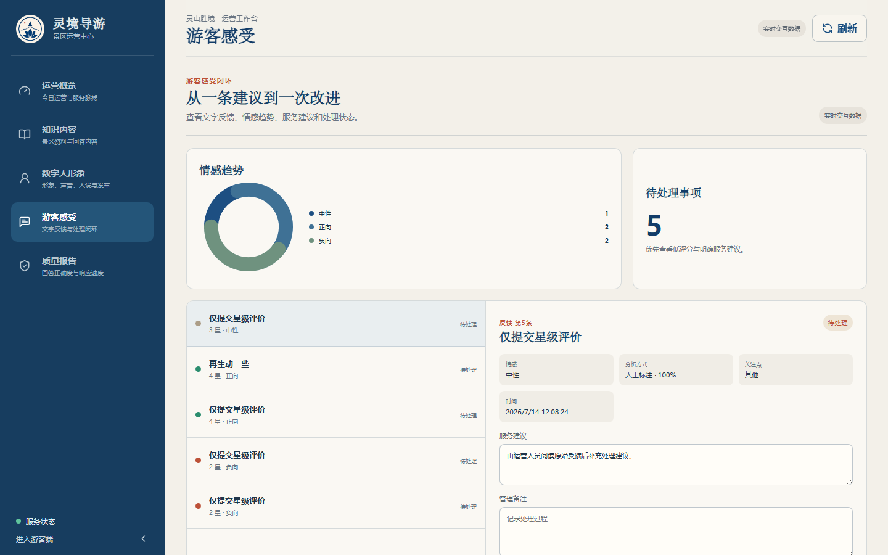
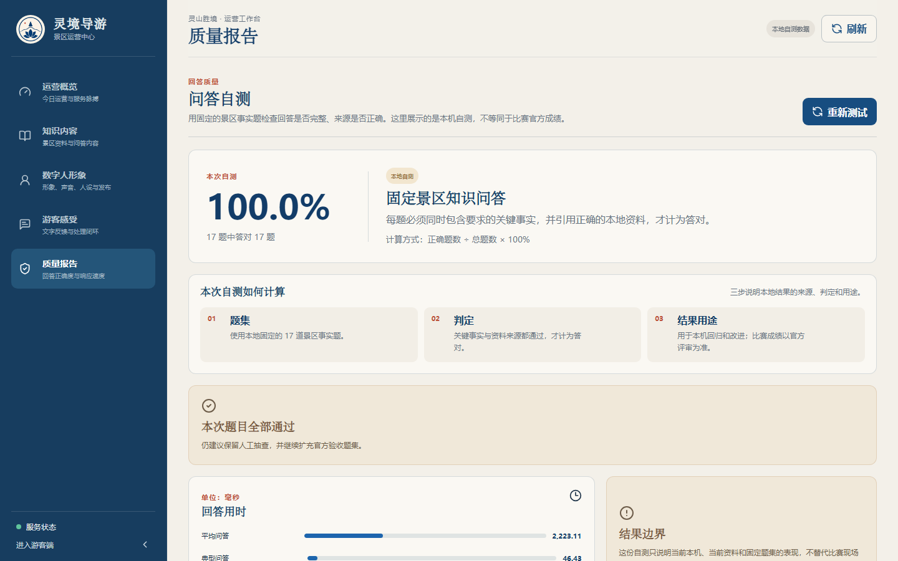

# 《灵境导游》部署与使用手册

> 面向智慧景区的多模态 AI 数字人导览系统 · V1.0  
> 适用版本：比赛提交版  
> 编制日期：2026 年 7 月 16 日


*图 1　系统能力示意。该图为概念插图，不作为功能实现证据；后文标注“真实运行截图”的图片均取自当前版本。*

## 阅读说明

本手册供评审专家、部署人员和景区运营人员使用，内容包括产品能力、首次部署、游客端和管理端操作、比赛演示顺序、故障处理及验收口径。

**证据口径：**本文所称“已实现”，均指当前版本已有代码或本地运行证据。本地自测不等于比赛官方成绩；数字人口型、语音和表情自然度以专家评审为准。

### 使用入口

| 使用者 | 默认入口 | 主要操作 |
| --- | --- | --- |
| 游客 | `http://127.0.0.1:3000` | 文本、语音和图片问答；路线讲解；评分反馈 |
| 景区运营人员 | `http://127.0.0.1:3000/admin` | 知识、数字人、反馈、数据和质量管理 |
| 部署人员 | 项目根目录及 `backend/storage/logs/` | 安装、启停、配置、检查和排障 |

若 3000 或 8000 端口被占用，启动脚本会选择相邻空闲端口。实际地址以 `backend/storage/runtime-ports.json` 为准。

### 目录

- [1. 评委三分钟速览](#1-评委三分钟速览)
- [2. 已准备演示机的五分钟启动](#2-已准备演示机的五分钟启动)
- [3. 产品概览](#3-产品概览)
- [4. 首次部署](#4-首次部署)
- [5. 日常启停与降级运行](#5-日常启停与降级运行)
- [6. 游客端使用](#6-游客端使用)
- [7. 管理端使用](#7-管理端使用)
- [8. 六至七分钟比赛演示](#8-六至七分钟比赛演示)
- [9. 安全与故障排查](#9-安全与故障排查)
- [10. 提交前验收](#10-提交前验收)
- [附录 A：环境变量](#附录-a环境变量)
- [附录 B：命令索引](#附录-b命令索引)
- [附录 C：实现边界](#附录-c实现边界)

---

## 1. 评委三分钟速览

“灵境导游”以比赛提供的灵山胜境资料为知识来源。游客可以用文字、语音或景点图片提问，数字人用中文语音和口型画面回答；景区运营人员可维护知识、发布数字人形象、处理游客反馈并查看运营和质量数据。

### 1.1 评分项与可核验证据

| 评分项 | 当前版本可现场展示的内容 | 证据位置 | 说明 |
| --- | --- | --- | --- |
| 功能完整度 40 分 | 文本/语音/图片交互、景区问答、路线讲解、数字人播报、知识管理、反馈处理、数据概览 | 图 2～7；游客端和管理端；第 6、7 章 | 核心功能可运行；完整语音问答 `<5 秒` 仍需按第 10.4 节采集 30 次真实样本 |
| 技术与创新性 30 分 | Qwen 多模态能力、本地资料增强问答、SQLite 混合检索、QuickTalk 常驻推理与 WebRTC 传输 | 第 3.3 节；`reports/quality/` | 本地题集和数字人链路有可复核报告；自然度由专家观看演示评定 |
| 行业实用与体验性 20 分 | 游客即时问答、按偏好选择游线、讲解控制、游客反馈到运营处理 | 图 3、5、6；第 6、7 章 | 当前是单机比赛版，不按生产系统口径承诺 7×24 可用性 |
| 文档质量 10 分 | 一键启动、部署说明、现场演示顺序、故障处理、验收矩阵 | 本手册第 2、4、8、9、10 章 | 截图与报告均标明证据属性和限制范围 |

### 1.2 当前版本自测结果

| 项目 | 最新可复核结果 | 结论范围 |
| --- | ---: | --- |
| 固定景区知识题集 | 17/17，100%；平均 2223.11 ms，P95 6825.17 ms | 本地自测，不是比赛官方准确率 |
| 第二套 30 题本地留出集 | 28/30，93.33%；平均 6287.52 ms，P95 15402.35 ms | 本地留出测试，不是官方隐藏集 |
| 创建数字人 session 到首个视频帧 | 755.5 ms | 单机 WebRTC 阶段，不含问答前置时间 |
| 音频上传到 `speaking` | 185.5 ms | 单次数字人链路 |
| 音频上传到可见嘴部运动 | 2927.1 ms | 当前形象和音频样本，不含 ASR、问答和 TTS |
| 说话阶段画面 | 126/126 帧唯一 | 证明画面未冻结，不等于自然度评分 |

上述问答结果见 `reports/quality/frozen-qa-latest.json` 和 `reports/quality/hidden-qa-latest.json`，数字人结果见 `reports/quality/opentalking-webrtc-latest.json`。

留出集失分集中在两道包含“游览建议 + 路线规划”的复合问题，FAQ 快通道发生了错误匹配。这说明事实问答已经具备较好基础，但复合意图识别仍有改进空间。

完整语音问答 `<5 秒` 目前没有 30 次真实浏览器链路 P95 报告。仓库中的一条旧端到端记录采集不完整，阶段合计约 17.739 秒，不能作为达标或稳定性能结论。正式提交前应按第 10.4 节重新采集。

### 1.3 核心链路实物


*图 2　游客端完成“灵山大照壁在哪里”问答并进入讲解状态。2026-07-16 本地真实运行截图。*

截图可证明问题、回答、讲解状态和数字人画面同时存在；口型同步仍应结合现场动态演示或 WebRTC 报告判断，不能由单张图片代替。

---

## 2. 已准备演示机的五分钟启动

本节适用于已经装好 Node.js、Python、前后端依赖、OpenTalking 运行时和模型资产的比赛电脑。新电脑首次部署请直接阅读第 4 章。

### 2.1 启动

双击项目根目录的 `start.bat`，或在 PowerShell 中执行：

```powershell
powershell -ExecutionPolicy Bypass -File scripts\start.ps1 -NoBrowser
```

脚本会重建本地知识库、构建前端、启动 OpenTalking、FastAPI 和 Next.js，并记录实际端口。

### 2.2 打开页面

- 游客端：`http://127.0.0.1:3000`
- 管理端：`http://127.0.0.1:3000/admin`
- 后端接口文档：`http://127.0.0.1:8000/docs`
- OpenTalking 健康页：`http://127.0.0.1:8210/health`

页面关闭后可双击 `open.bat` 重新打开，无需重复启动服务。

### 2.3 三项检查

- **页面和数据：**游客端返回 HTTP 200；后端 `/api/health` 返回 `ok=true`，知识规模为 3 个来源、22 个景点、66 个分片、113 条 FAQ。
- **数字人服务：**`/api/avatar/session-capability` 返回 `available=true`、`transport=webrtc`、`model=quicktalk`；预热日志达到 `ready` 或 `worker_ready`。
- **现场实测：**真人语音能转成文字，中文语音能播放，回答时 WebRTC 数字人画面可见且嘴部有运动。

按当前已启动的后端做严格检查：

```powershell
$runtime = Get-Content backend\storage\runtime-ports.json -Raw | ConvertFrom-Json
$env:LIVE_CHECK_BASE_URL = $runtime.api_base
$env:LIVE_CHECK_STRICT = "1"
npm run live-check
Remove-Item Env:LIVE_CHECK_BASE_URL, Env:LIVE_CHECK_STRICT -ErrorAction SilentlyContinue
```

结果写入 `reports/live-service-check-latest.json`。

### 2.4 停止

双击 `stop.bat`，或执行：

```powershell
powershell -ExecutionPolicy Bypass -File scripts\stop.ps1
```

---

## 3. 产品概览

### 3.1 解决的问题

景区旺季常见四类问题：专业讲解供给不足、录音导览不能追问、设备缺少真人式互动、运营人员难以看清游客真正关心什么。

本版本把两条业务线放进同一套系统：

- **游客服务线：**提问或识景 → 本地资料检索 → 生成回答 → 中文语音与数字人讲解 → 路线或继续追问 → 评分反馈。
- **景区运营线：**维护资料和数字人 → 查看互动与情感趋势 → 处理反馈 → 复测问答质量。


*图 3　游客端首页。左侧为数字人讲解区，右侧为对话、游线和输入区。2026-07-16 本地真实运行截图。*

### 3.2 系统组成



*图 4　系统逻辑架构。比赛版默认在同一台 Windows 电脑上运行。*

一次问答按以下顺序完成：

1. 前端提交文字、录音识别结果或图片；
2. 后端先查本地资料，再由 Qwen 或本地通道组织回答；
3. 回答以流式文本返回，同时请求中文语音；
4. 音频上传至常驻 QuickTalk session，经 WebRTC 返回视频；
5. 前端同步展示回答、字幕、讲解状态和数字人画面；
6. 交互记录进入运营统计，游客评分进入反馈处理页。

问答来源保留在后端接口和质量报告中，游客页暂不展示来源文件。

### 3.3 技术实现要点

#### 本地资料约束回答

系统不是让大模型脱离资料自由回答。当前在线查询由 SQLite 中的哈希向量相似度、关键词和 FTS 全文检索共同召回，FAQ 对常见事实问题提供快通道；Qwen 根据召回内容生成自然语言。Chroma 同步保存持久化索引，但当前 `retrieve()` 不直接查询 Chroma。

本地知识库重建结果为：

- 3 个资料来源；
- 22 个景点；
- 66 个可检索知识分片；
- 113 条 FAQ。

两份 DOCX 提供景区事实与讲解内容，XLSX 只用于运营分析样本，不冒充实时客流，也不作为景点事实问答分片。

#### 多模态交互

游客端统一处理文本、语音和景点图片。Qwen 负责多模态理解和复杂表达；外部模型不可用时，资料内的常见事实仍可由本地通道回答，但图片理解和复杂生成能力会下降。

#### 常驻数字人链路

完整模式使用 QuickTalk 常驻 worker、形象预热、分段音频预取和 WebRTC session，减少每次讲解重复加载模型的开销。语音可先播放，数字人视频随后接入；最终是否自然，以现场连续画面和专家观感为准。

#### 运营反馈

后台把问答、评分、情感、关注主题和处理状态放在同一条记录中。情感分类优先尝试 Qwen，失败时按星级和关键词降级；涉及投诉、安全或个人权益的内容仍需人工判断。

### 3.4 赛题要求与当前状态

| 赛题要求 | 当前实现 | 状态 |
| --- | --- | --- |
| 语音、文本、表情等多模态交互 | 文字、真人语音、图片、中文语音、口型视频、倾听/整理/讲解状态 | 部分实现：面部表情尚未由情绪模型实时驱动 |
| 景区知识问答 | 本地资料检索、FAQ 快通道、Qwen/本地回答、质量题集 | 可现场验证；官方准确率待比赛评测 |
| 个性化推荐 | 按亲子、文化、自然、经典偏好选择预设游线并补充景点讲解 | 可现场验证；不是实时路径优化 |
| 知识库管理 | 查看基础资料、导入 DOCX/XLSX、新增/修改/软删除运营内容、更新索引 | 可现场验证 |
| 数字人管理 | 上传授权照片、设置名称和人设、选择声音、试听、发布和预热 | 可现场验证；服装风格仅为文字标签 |
| 游客感受度报告 | 星级、文字反馈、情感、关注点、建议和处理状态 | 可现场验证 |
| 数据大屏 | 服务、问答、热门问题、满意度趋势和资料样本分析 | 可现场验证；数据来源在页面标注 |
| 语音问答延迟 `<5 秒` | 已有分阶段采集工具和 WebRTC 单阶段结果 | 待 30 次真实浏览器链路 P95 复验 |
| GPS 等复杂场景 | 仓库保留位置计算测试和扩展接口 | 正式游客页未启用 GPS 自动到站 |

---

## 4. 首次部署

以下命令均在项目根目录的 PowerShell 中执行。

### 4.1 环境要求

| 项目 | 要求或建议 |
| --- | --- |
| 操作系统 | Windows 10/11 64 位，PowerShell 5.1 或更高 |
| Node.js | 20 或更高，包含 npm |
| Python | 主应用 3.11+；OpenTalking 建议 3.11 或 3.12 |
| 浏览器 | 新版 Microsoft Edge 或 Google Chrome |
| 网络 | 首次安装、Qwen、Vivo ASR 和 Edge TTS 需要网络 |
| 普通模式硬件 | 文本问答和管理后台无专用 GPU 要求 |
| 完整数字人模式 | 当前目标演示机为 NVIDIA RTX 4060 8GB、QuickTalk、720×720、25fps |
| 其他设备 | 语音问答需麦克风和扬声器；相机识景需摄像头 |

RTX 4060 8GB 是当前作品的演示配置，不是任意素材、并发量和显卡上的性能承诺。

版本检查：

```powershell
node --version
npm --version
python --version
powershell -Command "$PSVersionTable.PSVersion"
```

### 4.2 目录与资产

```text
项目根目录/
├─ app/                         # Next.js 页面与同源代理
├─ components/                  # 游客端、数字人和后台组件
├─ backend/server/              # FastAPI 与业务逻辑
├─ backend/storage/             # 数据库、索引、音频、形象和日志
├─ reports/quality/             # 问答、时延和数字人质量报告
├─ scripts/                     # 安装、启停、审计和验收脚本
├─ third_party/opentalking/     # OpenTalking 运行时与模型
├─ 示范景区公开资料包/          # 比赛基础资料
├─ .env.example                 # 配置模板
└─ start.bat / stop.bat         # Windows 一键启停
```

OpenTalking 模型、独立运行时、数据库和数字人资产不随纯 Git 源码自动带齐。新比赛电脑必须提前下载，或从合规的离线资产包恢复。

### 4.3 安装主应用依赖

```powershell
npm install

python -m venv .venv
.\.venv\Scripts\python.exe -m pip install -r backend\requirements.txt
```

FAISS 是可选检索后端，只有明确需要时才安装：

```powershell
.\.venv\Scripts\python.exe -m pip install -r backend\requirements-vector.txt
```

### 4.4 创建本机配置

```powershell
Copy-Item .env.example .env
```

打开 `.env`，至少填写或核对 Qwen、语音和 OpenTalking 配置。密钥只保存在本机，不要放进截图、文档、日志或提交包。模板里的 `your_...` 必须替换或清空，否则程序会把占位符当作真实配置尝试调用。

完整模式的关键配置见附录 A。当前最近一次在线实测使用 Qwen、Vivo ASR、Edge TTS 和 OpenTalking QuickTalk/WebRTC；`.env.example` 的默认 ASR 值是 FunASR，复制后应按实际比赛环境修改。

### 4.5 准备 OpenTalking 与 QuickTalk

首次部署执行：

```powershell
$env:HF_ENDPOINT="https://hf-mirror.com"
npm run opentalking:setup
powershell -NoProfile -ExecutionPolicy Bypass `
  -File scripts\setup-opentalking-runtime.ps1 `
  -Device cuda
npm run opentalking:check
```

- `opentalking:setup` 准备源码、模型权重和资源；
- `setup-opentalking-runtime.ps1 -Device cuda` 创建当前 GPU 主链路所需的独立 Python 环境；
- `opentalking:check` 检查模型、形象和运行资源。

`npm run opentalking:runtime` 不带参数时按 CPU 环境安装，而当前完整模式使用 `cuda:0`，所以 GPU 比赛机应显式执行 `-Device cuda`。首次下载可能很久，必须在答辩前完成。

`opentalking:check` 还会检查旧 Wav2Lip 兼容资源。若它只因 Wav2Lip 缺失而失败，需继续核对 QuickTalk 资源、session capability 和现场视频，不能仅凭这一项判断主链路是否可用。

### 4.6 重建本地知识库

确认 `示范景区公开资料包` 中 3 份基础资料存在，然后执行：

```powershell
$env:PYTHONPATH = (Resolve-Path backend).Path
.\.venv\Scripts\python.exe -m server.cli rebuild
```

检查 `backend/storage/exports/knowledge_manifest.json`。正常规模为 3 个来源、22 个景点、66 个知识分片、113 条 FAQ。一键启动也会自动执行重建。

若后台已有补充内容，命令行重建会清除这些内容原有的检索分片，并把状态改回“等待更新”。启动完成后应进入“知识内容”，点击一次“全部更新”。

### 4.7 启动与健康检查

```powershell
powershell -ExecutionPolicy Bypass -File scripts\start.ps1 -NoBrowser
```

脚本会停止本项目遗留进程、检查依赖、重建知识库、选择端口、构建前端、启动并预热数字人、启动后端和前端，并把实际地址写入 `runtime-ports.json`。

读取实际端口并检查：

```powershell
$runtime = Get-Content backend\storage\runtime-ports.json -Raw | ConvertFrom-Json
$frontend = "http://127.0.0.1:$($runtime.frontend_port)"
$backend = $runtime.api_base
$session = $runtime.opentalking_session_base

Invoke-WebRequest $frontend -UseBasicParsing
Invoke-RestMethod "$backend/api/health"
Invoke-RestMethod "$backend/api/avatar/session-capability"
Invoke-RestMethod "$session/health"
$env:LIVE_CHECK_BASE_URL = $runtime.api_base
$env:LIVE_CHECK_STRICT = "1"
npm run live-check
Remove-Item Env:LIVE_CHECK_BASE_URL, Env:LIVE_CHECK_STRICT -ErrorAction SilentlyContinue
```

看到“QuickTalk avatar prewarm continues”表示服务已经可用、形象仍在后台预热，不是程序卡住。正式演示前应等预热日志达到 `ready` 或 `worker_ready`，并完成一次真人语音问答。

### 4.8 默认端口

| 端口 | 服务 | 用途 |
| ---: | --- | --- |
| 3000 | Next.js | 游客端与管理端 |
| 8000 | FastAPI | 业务 API 和接口文档 |
| 8210 | OpenTalking session | QuickTalk 与 WebRTC 主链路 |
| 8011 | 旧 OpenTalking 桥接 | 兼容兜底，默认不启动 |

3000 和 8000 被占用时会自动选择相邻空闲端口；8210 冲突时需停止占用进程或修改 `OPENTALKING_SESSION_BASE_URL`。

---

## 5. 日常启停与降级运行

### 5.1 启停与日志

| 操作 | 方法 |
| --- | --- |
| 启动 | 双击 `start.bat` |
| 停止 | 双击 `stop.bat` |
| 重新打开页面 | 双击 `open.bat` |
| 查看实际端口 | `Get-Content backend\storage\runtime-ports.json` |
| 查看日志 | 打开 `backend/storage/logs/` |

常用日志：

- `frontend.latest.log`：最新前端日志指针；
- `backend.latest.log`：最新后端日志指针；
- `opentalking-session.latest.log`：最新 session 日志指针；
- `opentalking-prewarm.latest.log`：数字人预热日志指针。

停止脚本会检查本项目运行端口和常见候选端口。在共享电脑执行前，先确认这些端口没有承载其他服务。

### 5.2 无法启用完整模式时

没有可用 GPU 或数字人服务临时异常时，在 `.env` 中设置：

```env
OPENTALKING_SESSION_ENABLED=0
OPENTALKING_SESSION_AUTOSTART=0
OPENTALKING_AUTOSTART=0
```

降级后仍可使用文本问答、本地检索、偏好游线、游客反馈和管理后台；TTS 可用时仍有中文语音与字幕。

外部能力异常时的影响如下：

| 异常项 | 保留能力 | 受影响能力 |
| --- | --- | --- |
| Qwen | 资料内常见事实、本地检索 | 图片理解、复杂开放式生成 |
| ASR | 文本提问 | 真人语音转文字 |
| TTS | 文字回答和字幕 | 真实中文语音及音频驱动口型 |
| OpenTalking | 问答、语音和字幕 | WebRTC 数字人视频 |

数字人降级顺序为 `session_stream → remote_provider → legacy_mp4 → audio_only`。当前正式主链路是 `session_stream`；远程 Provider 只是扩展接口，旧 MP4 只作兼容。静态海报、字幕或 CSS 动画不算真实口型。

`mock` ASR/TTS 只用于离线回归，不能作为比赛语音、口型或时延证据。

---

## 6. 游客端使用

### 6.1 文字问答

1. 打开游客端；
2. 在底部输入框键入景区问题，或点击推荐问题；
3. 提交后查看流式回答；
4. 需要继续了解时点击追问标签；
5. 回答结束后可给出星级和文字意见。

建议演示问题：

```text
九龙灌浴平日演出时间是什么？
灵山大照壁在哪里？
梵宫有哪些参观亮点？
```

回答中的景区事实来自本地资料。来源可在接口或管理端质量报告复核，游客页暂不显示来源文件。

浏览器会保存最近 40 条消息和最近游线，方便刷新后继续查看；模型请求主要使用本轮输入，不应描述为具备完整历史上下文记忆的多轮智能体。

### 6.2 语音问答与播报控制

1. 首次使用时允许浏览器访问麦克风；
2. 点击麦克风开始录音，说完后再次点击结束；
3. 等待识别文本和回答；
4. 观察“倾听、整理、讲解”等状态；
5. 讲解时可暂停、继续或停止；
6. 根据现场需要调整语速、音量、音色或字幕。

正式演示必须使用真人录音和真实音频。固定 mock 文本、空音频、静态头像或预设 CSS 动画都不能代替真实链路。

### 6.3 图片与相机识景

1. 点击输入框右侧“+”；
2. 选择“上传照片”或“相机识景”；
3. 选取或拍摄清晰景点画面；
4. 输入“我现在看到的是哪里？有什么典故？”并提交；
5. 核对回答是否与画面和本地资料一致。

相机需要浏览器授权；远程地址使用相机和麦克风时应配置 HTTPS。本地 `127.0.0.1` 可直接用于比赛演示。

### 6.4 推荐游线与站点讲解

可直接说：

```text
带孩子游览，帮我安排半日路线。
我喜欢历史文化，推荐一条路线。
我更想看自然风光，怎么走比较合适？
```

系统根据文字偏好在亲子、文化、自然和经典四套游线中选择，并用本地景点资料补充每站讲解。同行人和兴趣会影响模板选择；“半日”等时长描述目前不会动态改变站点数量或路径。


*图 5　经典半日线的站点顺序、地图示意和“讲这一站”入口。2026-07-16 本地真实运行截图。*

使用方法：

1. 点击顶部“推荐游线”，或在对话中提出路线需求；
2. 切换到“当前游线”；
3. 点击站点查看位置、开放信息和讲解重点；
4. 点击“讲这一站”播放当前站讲解；
5. 游览到下一站时手动切换。

地图用于展示资料中的站点顺序，不是实时地图导航。目前不含 GPS 自动到站、实时拥挤度、实时开放状态、最短路径或转弯级导航。

### 6.5 提交反馈

回答下方可选择 1～5 星并补充文字。反馈提交后进入管理端“游客感受”，运营人员可记录建议、跟进和完成处理。

---

## 7. 管理端使用

### 7.1 运营概览

打开 `/admin` 后，首页显示当日和本周服务、满意度、热门问答、服务趋势及知识数量。


*图 6　运营概览同时标注实时交互数据、本地自测数据和示例景区数据。2026-07-16 本地真实运行截图。*

主要口径：

| 指标 | 当前计算方式 |
| --- | --- |
| 今日服务人次 | 当日互动记录按 User-Agent 哈希去重，适合单机演示，不等同于实名游客数 |
| 本周服务人次 | 最近 7 日互动记录计数 |
| 热门问答 | 相同问题至少出现 2 次后进入排行 |
| 平均满意度 | 已评分记录的星级算术平均，满分 5 分 |
| 已索引内容 | 已载入源文件数加运营文档数，不等于知识分片数 |

需要验证实时数据进入后台时，可先在游客端完成两次相同问答并提交一条测试评分，再刷新管理端；展示时说明这些数据由本次演示操作产生。

### 7.2 知识内容



*图 7　基础资料、索引状态和运营内容编辑区。2026-07-16 本地真实运行截图。*

#### 查看基础资料

“知识内容”页可查看 3 份本地基础资料。基础资料为只读，避免误删比赛事实依据。

#### 导入资料

1. 点击“导入资料”；
2. 选择 `.docx` 或 `.xlsx` 文件；
3. 等待全量知识库重建；
4. 确认资料已载入，再用一条明确事实问题复测。

后端目前只接收 DOCX 和 XLSX。文件选择器中出现的 PDF、TXT、Markdown 和 CSV 暂不可用。导入会触发全量重建，建议赛前完成并备份。

#### 新增或修改运营内容

1. 输入标题和经过景区核验的正文；
2. 创建内容或保存修改；
3. 点击“更新问答依据”或“全部更新”；
4. 检查索引状态并复测。

页面中的“保存后自动更新”提示与当前后端行为不完全一致。新增或修改后仍须手动更新索引；删除采用软删除。

### 7.3 数字人形象

1. 上传有使用授权的 JPG、PNG 或 WEBP 照片，单文件不超过 12 MB；
2. 填写显示名称和人设；
3. 在“温暖女声、沉稳男声、活力女声”中选择默认声音；
4. 修改试听内容并试听；
5. 等待照片处理和 QuickTalk 预热；
6. 点击“保存并应用”；
7. 回到游客端刷新，确认形象、名称、人设和声音已经生效。

建议使用人脸清晰、无遮挡、光线均匀、嘴唇自然闭合的半身照片。后台的“文化风格/服装风格”只是人设文字标签，不会自动生成换装画面。静态预览也不代表 WebRTC 视频已经就绪，必须回到游客端实测。

首次创建新形象可能需要数分钟。比赛演示应使用已经预热的授权形象，不要在计时阶段临时换图。

### 7.4 游客感受



*图 8　反馈的星级、情感、关注点、建议和处理状态。2026-07-16 本地真实运行截图。*

1. 选择一条反馈；
2. 查看星级、文字、情感倾向、分析方式、置信度和关注点；
3. 在“服务建议”和“管理备注”中记录处理意见；
4. 点击“标记跟进”，状态变为“跟进中”；
5. 处理完成后点击“完成处理”。

情感与主题只用于辅助运营。低评分、投诉、安全或个人权益问题必须人工复核。

### 7.5 质量报告



*图 9　固定景区知识问答的本地自测结果及使用边界。2026-07-16 本地真实运行截图。*

质量报告展示题数、通过数、正确率、资料依据和响应时间。每道题只有同时包含要求的关键事实并引用正确本地资料才计为通过。

“重新测试”会执行整套真实问答链，可能调用外部模型并耗时。计时演示建议展示同日已生成报告，网络稳定且时间充足时再重测。页面应始终保留“本地自测”标记。

---

## 8. 六至七分钟比赛演示

建议把时间留给一条游客主链路和一条运营主链路，不逐页念功能清单。

| 环节 | 时间 | 操作与评委可见结果 |
| --- | ---: | --- |
| 1. 可信问答 | 1 分钟 | 游客端提问“九龙灌浴平日演出时间是什么？”，展示准确回答；切到质量报告说明本地资料和自测口径 |
| 2. 语音与数字人 | 1.5 分钟 | 真人用麦克风提问，展示识别文本、中文语音、WebRTC 连续画面、嘴部运动及暂停/继续 |
| 3. 路线与识景 | 1.5 分钟 | 提出“我喜欢历史文化，推荐半日路线”，打开当前游线并“讲这一站”；再上传一张景点图提问 |
| 4. 数字人发布 | 1 分钟 | 后台展示已预热授权形象、名称、人设和声音；只说明发布流程，不现场更换新照片 |
| 5. 反馈处理 | 1 分钟 | 游客端提交一条测试反馈，后台展示情感、关注点和“待处理→跟进中→已解决” |
| 6. 数据与边界 | 1 分钟 | 展示运营概览和质量报告，说明实时交互数据、资料样本、本地自测与官方评测的区别 |

现场应急：

- 语音不可用：改用文本输入，并说明 ASR 正在降级；
- 数字人不可用：保留语音和字幕，明确 WebRTC 链路未就绪；
- Qwen 超时：使用已核验的景区事实题，展示本地资料回退；
- 游线没有出现：使用明确句式“我喜欢历史文化，推荐一条路线”；
- 页面仍是旧版本：读取 `runtime-ports.json`，访问实际端口后按 `Ctrl+F5`。

不要把降级画面包装成完整模式。评委追问时直接说明当前运行 Provider 和证据范围。

---

## 9. 安全与故障排查

### 9.1 当前部署安全边界

- 服务默认绑定 `127.0.0.1`，适合单机比赛演示；
- 管理端当前没有登录认证，不应直接开放到局域网或公网；
- 公网使用前须补充 HTTPS、身份认证、角色权限、操作审计和限流；
- 当前 `/static/*` 可触达 `backend/storage` 下的文件，公网改造前必须改为音频和公开素材白名单；
- 不要直接暴露 FastAPI、OpenTalking、SQLite、日志或内部报告；
- 数字人照片、景区资料和录音须确认授权及留存范围。

### 9.2 凭据与备份

`.env` 只保存在比赛电脑，提交材料不得包含真实密钥。停止服务后建议备份：

```text
.env                                  # 加密保存，不进入公开提交包
backend/storage/lingjing.db
backend/storage/chroma/
backend/storage/opentalking-avatar/
backend/storage/admin-assets/
backend/storage/exports/
reports/quality/
```

恢复后先执行知识库重建、健康检查和一条事实问答。

### 9.3 常见故障

| 现象 | 处理 |
| --- | --- |
| 找不到 Node.js、npm 或 Python | 安装 Node.js 20+、Python 3.11+，重开 PowerShell；必要时设置 `LINGJING_PYTHON` |
| 默认 3000/8000 打不开 | 读取 `backend/storage/runtime-ports.json`，使用实际端口 |
| 页面或服务启动失败 | 查看 `backend/storage/logs/`；停止后重启；再执行 `npm run typecheck`、`npm run build` |
| Qwen 回退本地回答 | 检查 Key、Base URL、模型名和网络；本地事实仍可答，图片和复杂生成可能不可用 |
| 麦克风或相机不可用 | 重新授权浏览器权限，关闭占用设备的会议软件；远程访问配置 HTTPS |
| 数字人有头像但不动 | 检查 8210 健康页、session capability、预热日志、avatar ID、WebRTC、CUDA 和显存 |
| 有画面但没有中文语音 | 检查系统音量、TTS 接口、Edge TTS 网络和后端日志；不要用空音频验收 |
| 显存不足 | 关闭其他 GPU 程序，保持已验证的 QuickTalk 配置；仍不稳定时切换语音+字幕降级模式 |
| 新知识没有进入回答 | 保存后点击“更新问答依据”或“全部更新”；必要时执行 `server.cli rebuild` |

---

## 10. 提交前验收

### 10.1 静态、测试与构建

```powershell
npm run startup-audit
npm run typecheck
npm run location-test
npm run location-contract:test
npm run flow-audit
npm run admin-audit
npm run copy-audit
npm run goal-audit
.\.venv\Scripts\python.exe -m unittest discover -s backend\tests -p test_*.py
npm run build
```

### 10.2 离线回归

```powershell
npm run self-check
```

结果写入 `reports/self-check-latest.json`。该命令固定使用 mock ASR/TTS，只证明代码、测试、构建和页面回归，不证明真实语音、口型或比赛时延。

### 10.3 在线链路

```powershell
$runtime = Get-Content backend\storage\runtime-ports.json -Raw | ConvertFrom-Json
$env:LIVE_CHECK_BASE_URL = $runtime.api_base
$env:LIVE_CHECK_STRICT = "1"
npm run live-check
Remove-Item Env:LIVE_CHECK_BASE_URL, Env:LIVE_CHECK_STRICT -ErrorAction SilentlyContinue
```

逐项确认：

- 游客端和管理端可访问；
- Qwen 真实调用可用；
- 真人语音能转成正确文字；
- TTS 返回可播放的中文音频；
- OpenTalking session 可用；
- WebRTC 同时收到音频轨和视频轨；
- 回答时画面持续变化，嘴部有可见运动。

### 10.4 采集 30 次完整端到端时延

1. 打开 `http://127.0.0.1:3000/?benchmark=1`；
2. 等待数字人预热完成；
3. 在浏览器控制台执行：

```javascript
window.__LINGJING_E2E_BENCHMARK__.clear()
```

4. 真人连续完成 30 次“开始录音—提问—结束录音”；
5. 检查并导出：

```javascript
window.__LINGJING_E2E_BENCHMARK__.getSamples()
window.__LINGJING_E2E_BENCHMARK__.download()
```

6. 保存为 `reports/quality/browser-e2e-samples.json`；
7. 执行严格验收：

```powershell
$env:COMPETITION_E2E_SAMPLE_FILE="reports/quality/browser-e2e-samples.json"
npm run competition-check
```

只检查代码、测试和构建时可运行 `npm run competition-check:static`，但静态模式不能得出“完整比赛链路已就绪”的结论。

### 10.5 赛题要求—证据矩阵

| 编号 | 验收项 | 现场通过标准 | 证据 |
| --- | --- | --- | --- |
| F-01 | 文本问答 | 回答包含正确景区事实 | 图 2；接口来源字段；质量报告 |
| F-02 | 语音输入 | 真人录音被正确识别并触发回答 | 现场操作；`live-service-check-latest.json` |
| F-03 | 图片/相机 | 图片进入本轮并参与景点识别 | 现场操作 |
| F-04 | 数字人 | WebRTC 视频可见，播报时嘴部运动 | 现场动态；`opentalking-webrtc-latest.json` |
| F-05 | 讲解控制 | 语速、音量、字幕、暂停和继续可用 | 现场操作 |
| F-06 | 推荐游线 | 偏好选择路线，可切换站点并讲解 | 图 5；现场操作 |
| F-07 | 知识管理 | 基础资料可查，运营内容可维护并更新索引 | 图 7 |
| F-08 | 形象管理 | 授权图片、声音和人设发布后影响游客端 | 现场操作 |
| F-09 | 感受度报告 | 反馈显示情感、主题和建议，并完成处理 | 图 8 |
| F-10 | 数据概览 | 展示服务、问答、热门问题和满意度，注明来源 | 图 6 |
| F-11 | 质量报告 | 展示题数、通过数、依据和本地自测标记 | 图 9 |
| F-12 | 稳定与降级 | 外部服务异常时仍可完成文本问答 | 降级实测；日志 |
| N-01 | 准确率 | 官方测试集事实问答不低于 90% | 待比赛官方评测；本地题集仅供预检 |
| N-02 | 响应时延 | 30 次真实语音问答 P95 `<5 秒` | `browser-e2e-samples.json`，当前待补 |
| N-03 | 自然度 | 口型、语音和状态配合自然 | 专家评审和演示视频 |

### 10.6 提交前清单

#### 部署

- [ ] Node.js、Python、npm、PowerShell 可用；
- [ ] `.env` 已填真实配置，提交包没有密钥；
- [ ] OpenTalking、QuickTalk 权重和授权形象已准备并预热；
- [ ] 知识规模为 3/22/66/113；
- [ ] 游客端、管理端、FastAPI、OpenTalking 健康检查通过；
- [ ] 前后端和数字人最新日志无持续错误。

#### 功能

- [ ] 文本、真人语音和图片问答可用；
- [ ] 中文语音可播放，WebRTC 画面与嘴部运动可见；
- [ ] 推荐游线、站点切换和讲解可用；
- [ ] 反馈能进入后台并完成处理；
- [ ] 数字人形象、声音和人设发布流程可用；
- [ ] 数据来源和“本地自测”标记清楚。

#### 表述

- [ ] 不把本地题集说成比赛官方准确率；
- [ ] 不把 WebRTC 单阶段时延说成完整语音问答时延；
- [ ] 不把静态头像、字幕或动画说成真实口型；
- [ ] 不把 XLSX 样本说成当天客流；
- [ ] 不声称已有 GPS 自动到站、实时路线优化或转弯导航；
- [ ] 不声称服装标签会生成换装画面；
- [ ] 自然度结论交由专家评审。

---

## 附录 A：环境变量

以下为完整比赛模式的关键项，具体可选 Provider 和默认值以 `.env.example` 为准。

```env
APP_ENV=local
DATA_PACKAGE_DIR=示范景区公开资料包
DATABASE_PATH=backend/storage/lingjing.db
STORAGE_DIR=backend/storage
VECTOR_BACKEND=chroma

# Qwen
QWEN_API_KEY=替换为真实密钥
QWEN_BASE_URL=https://dashscope.aliyuncs.com/compatible-mode/v1
QWEN_MODEL=qwen3.5-omni-plus-2026-03-15

# 最近一次在线实测语音配置
ASR_PROVIDER=vivo
TTS_PROVIDER=edge
VIVO_APP_ID=替换为真实应用ID
VIVO_APP_KEY=替换为真实应用密钥

# OpenTalking QuickTalk / WebRTC
OPENTALKING_SESSION_ENABLED=1
OPENTALKING_SESSION_AUTOSTART=1
OPENTALKING_SESSION_BASE_URL=http://127.0.0.1:8210
OPENTALKING_SESSION_MODEL=quicktalk
OPENTALKING_SESSION_AVATAR_ID=lingjing-guide-quicktalk
OPENTALKING_SESSION_PYTHON=third_party/opentalking/.venv/Scripts/python.exe
OPENTALKING_SESSION_AVATARS_DIR=backend/storage/opentalking-avatar

OPENTALKING_QUICKTALK_DEVICE=cuda:0
OPENTALKING_QUICKTALK_HUBERT_DEVICE=cuda:0
OPENTALKING_QUICKTALK_FPS=25
OPENTALKING_QUICKTALK_SLICE_LEN=28
OPENTALKING_QUICKTALK_RENDER_CHUNK_MS=500
OPENTALKING_QUICKTALK_PREFETCH=1
OPENTALKING_QUICKTALK_WORKER_CACHE=1

# 旧 MP4 桥接默认关闭
OPENTALKING_AUTOSTART=0
OPENTALKING_BASE_URL=
```

Edge TTS 无 API Key，但需要网络和可用的 `edge-tts` 运行环境。改用 FunASR 时设置 `ASR_PROVIDER=funasr`，并填写本地服务地址或模型目录。

---

## 附录 B：命令索引

| 操作 | 命令 |
| --- | --- |
| 一键启动 | 双击 `start.bat` |
| 无浏览器启动 | `powershell -ExecutionPolicy Bypass -File scripts\start.ps1 -NoBrowser` |
| 停止服务 | `powershell -ExecutionPolicy Bypass -File scripts\stop.ps1` |
| 查看实际端口 | `Get-Content backend\storage\runtime-ports.json` |
| 重建知识库 | `$env:PYTHONPATH=(Resolve-Path backend).Path; .\.venv\Scripts\python.exe -m server.cli rebuild` |
| 检查 OpenTalking 资源 | `npm run opentalking:check` |
| 类型检查 | `npm run typecheck` |
| 后端测试 | `.\.venv\Scripts\python.exe -m unittest discover -s backend\tests -p test_*.py` |
| 生产构建 | `npm run build` |
| 离线回归 | `npm run self-check` |
| 检查当前在线服务 | `$runtime=ConvertFrom-Json -InputObject (Get-Content backend\storage\runtime-ports.json -Raw); $env:LIVE_CHECK_BASE_URL=$runtime.api_base; $env:LIVE_CHECK_STRICT="1"; npm run live-check` |
| 静态赛事回归 | `npm run competition-check:static` |

---

## 附录 C：实现边界

为避免演示口径超过当前实现，统一按下表说明。

| 能力 | 当前边界 |
| --- | --- |
| 回答来源 | 后端和质量报告保留来源；游客页暂不展示来源文件 |
| 多轮对话 | 浏览器保存最近消息；模型请求主要使用本轮输入 |
| 个性化路线 | 四套偏好模板；时长不动态改变路线，不含实时规划 |
| GPS | 正式游客页未启用自动到站；不提供转弯级导航 |
| 表情 | 有交互状态和情感分析；面部表情不由情绪模型实时驱动 |
| 数字人服装 | “文化/服装风格”为文字标签，不生成换装画面 |
| 知识格式 | 后端只接收 DOCX/XLSX；新增或修改后要手动更新索引 |
| 运营数据 | XLSX 是分析样本，不是当天实时客流；服务人次采用单机演示口径 |
| 管理端安全 | 当前无登录，仅适合本机；公网前须补认证、权限、审计和静态文件白名单 |
| 运行资产 | 模型、独立运行时和 `backend/storage` 不随纯 Git 源码自动带齐 |
| 准确率 | 本地 100%/93.33% 只作预检；官方结果以比赛评测为准 |
| `<5 秒` 时延 | 当前未形成 30 次完整浏览器链路 P95 达标报告 |
| 自然度 | 由演示视频和专家现场评价，不能由静态截图或单个时延数字替代 |

提交或演示前，请完成第 10.6 节检查表，并按本附录统一对外表述。
